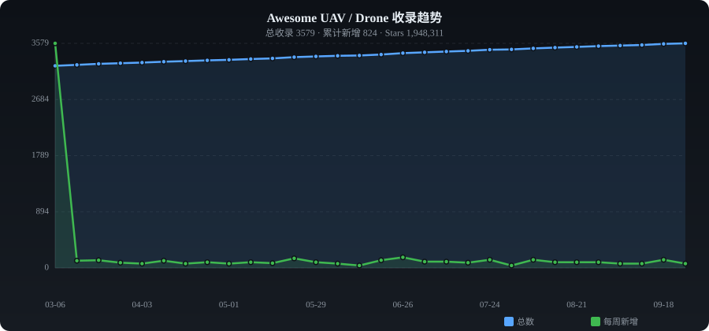

# ✨ Awesome UAV / Drone

**English** | [中文](./README_ZH.md)

> Curated collection of UAV & Drone — flight control, autonomy, swarm, vision, applications & more

   

---

## 📈 Trends

---

## 📊 Category Stats

| Category | Count | Share |
|----------|------:|------:|
| 🎮 Flight Control & Firmware | 602 | █████ 17.9% |
| 🧭 Autonomy & Planning | 154 | █ 4.6% |
| 🐝 Swarm & Cooperative | 249 | ██ 7.4% |
| 👁️ Vision & Perception | 37 | █ 1.1% |
| 🎮 Simulation & Tools | 353 | ███ 10.5% |
| 📦 Applications | 35 | █ 1.0% |
| 📦 Others | 487 | ████ 14.4% |

---

## 🔥 Weekly Trending (2026-05-29)

| # | Project | ⭐ | 📈 Gain | Description |
|:-:|---------|---:|-------:|-------------|
| 1 | [dimensionalOS/dimos](https://github.com/dimensionalOS/dimos) | 3,370 | +63 | Dimensional is the agentic operating system for physical spa |
| 2 | [PX4/PX4-Autopilot](https://github.com/PX4/PX4-Autopilot) | 11,841 | +55 | PX4 Autopilot Software |
| 3 | [ExperimentalDesignBureau-1571/fpv-ground-control-station](https://github.com/ExperimentalDesignBureau-1571/fpv-ground-control-station) | 124 | +50 | Modular Ground Control Station for FPV Drones |
| 4 | [guchuanv-alt/SimART](https://github.com/guchuanv-alt/SimART) | 145 | +35 | An open-source software platform for all-scenario wireless c |
| 5 | [betaflight/betaflight](https://github.com/betaflight/betaflight) | 11,013 | +30 | Open Source Flight Controller Firmware |
| 6 | [ArduPilot/ardupilot](https://github.com/ArduPilot/ardupilot) | 15,160 | +29 | ArduPlane, ArduCopter, ArduRover, ArduSub source |
| 7 | [mavlink/qgroundcontrol](https://github.com/mavlink/qgroundcontrol) | 4,624 | +29 | Cross-platform ground control station for drones (Android, i |
| 8 | [okalachev/flix](https://github.com/okalachev/flix) | 933 | +28 | Making an ESP32-based quadcopter from scratch |
| 9 | [cirosantilli/china-dictatorship](https://github.com/cirosantilli/china-dictatorship) | 3,024 | +23 | 反中共政治宣传库。Anti Chinese government propaganda. 住在中国真名用户的网友请别给星 |
| 10 | [VisDrone/VisDrone-Dataset](https://github.com/VisDrone/VisDrone-Dataset) | 2,347 | +23 | The dataset for drone based detection and tracking is releas |
| 11 | [ExpressLRS/ExpressLRS](https://github.com/ExpressLRS/ExpressLRS) | 4,971 | +19 | ESP32/ESP8285-based High-Performance Radio Link for RC appli |
| 12 | [facontidavide/PlotJuggler](https://github.com/facontidavide/PlotJuggler) | 5,829 | +18 | The Time Series Visualization Tool that you deserve. |
| 13 | [OpenDroneMap/ODM](https://github.com/OpenDroneMap/ODM) | 6,121 | +17 | A command line toolkit to generate maps, point clouds, 3D mo |
| 14 | [hybridgroup/gobot](https://github.com/hybridgroup/gobot) | 9,417 | +15 | Golang framework for robotics, drones, and the Internet of T |
| 15 | [PlotJuggler/PlotJuggler](https://github.com/PlotJuggler/PlotJuggler) | 5,924 | +14 | The Time Series Visualization Tool that you deserve. |
| 16 | [but0n/Avem](https://github.com/but0n/Avem) | 2,793 | +13 | 🚁 轻量级无人机飞控-[Drone]-[STM32]-[PID]-[BLDC] |
| 17 | [ZJU-FAST-Lab/ego-planner-swarm](https://github.com/ZJU-FAST-Lab/ego-planner-swarm) | 2,056 | +13 | An efficient single/multi-agent trajectory planner for multi |
| 18 | [utiasDSL/gym-pybullet-drones](https://github.com/utiasDSL/gym-pybullet-drones) | 1,977 | +13 | PyBullet Gymnasium environments for single and multi-agent r |
| 19 | [espressif/esp-drone](https://github.com/espressif/esp-drone) | 1,866 | +13 | Mini Drone/Quadcopter Firmware for ESP32 and ESP32-S Series  |
| 20 | [louiszengCN/CarlaAir](https://github.com/louiszengCN/CarlaAir) | 966 | +13 | CarlaAir: A unified air-ground simulation platform integrati |

---

## 📁 Categories

- [🎮 Flight Control & Firmware](#flight-control) (602)
- [🧭 Autonomy & Planning](#autonomy) (154)
- [🐝 Swarm & Cooperative](#swarm) (249)
- [👁️ Vision & Perception](#vision) (37)
- [🎮 Simulation & Tools](#simulation) (353)
- [📦 Applications](#application) (35)
- [📦 Others](#other) (487)

---

### 🎮 Flight Control & Firmware

| Project | ⭐ | Language | Description |
|---------|---:|:--------:|-------------|
| [ReFirmLabs/binwalk](https://github.com/ReFirmLabs/binwalk) | 13,621 | Rust | Firmware Analysis Tool |
| [betaflight/betaflight](https://github.com/betaflight/betaflight) | 11,013 | C | Open Source Flight Controller Firmware |
| [gyroflow/gyroflow](https://github.com/gyroflow/gyroflow) | 8,273 | Rust | Video stabilization using gyroscope data |
| [PlotJuggler/PlotJuggler](https://github.com/PlotJuggler/PlotJuggler) | 5,924 | C++ | The Time Series Visualization Tool that you deserve. |
| [facontidavide/PlotJuggler](https://github.com/facontidavide/PlotJuggler) | 5,829 | C++ | The Time Series Visualization Tool that you deserve. |
| [mavlink/qgroundcontrol](https://github.com/mavlink/qgroundcontrol) | 4,624 | C++ | Cross-platform ground control station for drones (Android, iOS, Mac OS |
| [iNavFlight/inav](https://github.com/iNavFlight/inav) | 4,101 | C | INAV: Navigation-enabled flight control software |
| [inavFlight/inav](https://github.com/iNavFlight/inav) | 3,968 | C | INAV: Navigation-enabled flight control software |
| [e-m-b-a/emba](https://github.com/e-m-b-a/emba) | 3,374 | Shell | EMBA - The firmware security analyzer |
| [but0n/Avem](https://github.com/but0n/Avem) | 2,793 | C | 🚁 轻量级无人机飞控-[Drone]-[STM32]-[PID]-[BLDC] |
| [cleanflight/cleanflight](https://github.com/cleanflight/cleanflight) | 2,722 | C | Clean-code version of the baseflight flight controller firmware |
| [ArduPilot/MissionPlanner](https://github.com/ArduPilot/MissionPlanner) | 2,253 | C# | Mission Planner Ground Control Station for ArduPilot (c# .net) |
| [opentx/opentx](https://github.com/opentx/opentx) | 2,175 | C++ | OpenTX custom firmware for Transmitters |
| [o-gs/dji-firmware-tools](https://github.com/o-gs/dji-firmware-tools) | 2,082 | C | Tools for handling firmwares of DJI products, with focus on quadcopter |
| [generalized-intelligence/GAAS](https://github.com/generalized-intelligence/GAAS) | 2,062 | C++ | GAAS is an open-source program designed for fully autonomous VTOL(a.k. |
| [espressif/esp-drone](https://github.com/espressif/esp-drone) | 1,866 | C | Mini Drone/Quadcopter Firmware for ESP32 and ESP32-S Series SoCs. |
| [ethz-adrl/control-toolbox](https://github.com/ethz-adrl/control-toolbox) | 1,662 | C++ | The Control Toolbox - An Open-Source C++ Library for Robotics, Optimal |
| [ArduPilots/MissionPlanner](https://github.com/ArduPilots/MissionPlanner) | 1,591 | C# | Mission Planner Ground Control Station for ArduPilot (c# .net) |
| [dRoninFlight/dRonin](https://github.com/dRoninFlight/dRonin) | 1,524 | C | The dRonin flight controller software. |
| [bitcraze/crazyflie-firmware](https://github.com/bitcraze/crazyflie-firmware) | 1,485 | C | The main firmware for the Crazyflie Nano Quadcopter, Crazyflie Bolt Qu |
| [ShlkOfTheRa/scarab-osd](https://github.com/ShlkOfTheRa/scarab-osd) | 1,485 | C | MWOSD - UAV HUD |
| [ArduPilots/ardupilot](https://github.com/ArduPilots/ardupilot) | 1,450 | C++ | ArduPlane, ArduCopter, ArduRover, ArduSub source |
| [nickrehm/dRehmFlight](https://github.com/nickrehm/dRehmFlight) | 1,394 | C++ | Teensy/Arduino flight controller and stabilization for small-scale VTO |
| [pixhawk/Hardware](https://github.com/pixhawk/Hardware) | 1,323 | Shell | PX4 Hardware designs |
| [google/makani](https://github.com/google/makani) | 1,204 | C++ | Makani was a project to develop a commercial-scale airborne wind turbi |
| [craigz28/firmwalker](https://github.com/craigz28/firmwalker) | 1,191 | Shell | Script for searching the extracted firmware file system for goodies! |
| [flashrom/flashrom](https://github.com/flashrom/flashrom) | 1,086 | C | Send patches to https://review.coreboot.org: https://www.flashrom.org/ |
| [TinyMPC/TinyMPC](https://github.com/TinyMPC/TinyMPC) | 995 | C++ | Model-predictive control for microcontrollers |
| [dji-sdk/Onboard-SDK](https://github.com/dji-sdk/Onboard-SDK) | 980 | C++ | DJI Onboard SDK Official Repository |
| [dji-sdk/onboard](https://github.com/dji-sdk/Onboard-SDK) | 971 | C++ | DJI Onboard SDK Official Repository |
| [rampageX/firmware-mod-kit](https://github.com/rampageX/firmware-mod-kit) | 965 | C | Automatically exported from code.google.com/p/firmware-mod-kit |
| [okalachev/flix](https://github.com/okalachev/flix) | 933 | C++ | Making an ESP32-based quadcopter from scratch |
| [cyphunk/JTAGenum](https://github.com/cyphunk/JTAGenum) | 786 | C++ | Given an Arduino compatible microcontroller or Raspberry PI (experimen |
| [iNavFlight/inav-configurator](https://github.com/iNavFlight/inav-configurator) | 765 | JavaScript |  |
| [am32-firmware/AM32](https://github.com/am32-firmware/AM32) | 763 | C |  |
| [Robotics-STAR-Lab/RACER](https://github.com/Robotics-STAR-Lab/RACER) | 755 | C++ | Rapid Exploration with Multiple Unmanned Aerial Vehicles (UAV) |
| [PX4/PX4-Avoidance](https://github.com/PX4/PX4-Avoidance) | 743 | C++ | PX4 avoidance ROS node for obstacle detection and avoidance. |
| [rtlopez/esp-fc](https://github.com/rtlopez/esp-fc) | 714 | C++ | Flight controller software for hobbyist - build your own flight contro |
| [olliw42/storm32bgc](https://github.com/olliw42/storm32bgc) | 714 | C++ | 3-axis Brushless Gimbal Controller, based on STM32 32-bit microcontrol |
| [hanyazou/TelloPy](https://github.com/hanyazou/TelloPy) | 712 | Python | DJI Tello drone controller python package |

---

### 🧭 Autonomy & Planning

| Project | ⭐ | Language | Description |
|---------|---:|:--------:|-------------|
| [samyk/skyjack](https://github.com/samyk/skyjack) | 1,814 | JavaScript | A drone engineered to autonomously seek out, hack, and wirelessly take |
| [louiszengCN/CarlaAir](https://github.com/louiszengCN/CarlaAir) | 966 | C++ | CarlaAir: A unified air-ground simulation platform integrating CARLA a |
| [uzh-rpg/agilicious](https://github.com/uzh-rpg/agilicious) | 573 | TeX | Agile flight done right! |
| [ZJU-FAST-Lab/Swarm-Formation](https://github.com/ZJU-FAST-Lab/Swarm-Formation) | 545 | C++ | Formation Flight in Dense Environments |
| [Zihao-Felix-Zhou/UavNetSim](https://github.com/Zihao-Felix-Zhou/UavNetSim) | 333 | Python | UavNetSim: A Python-based simulation platform for designing and testin |
| [htcr/sam_road](https://github.com/htcr/sam_road) | 278 | Python | Segment Anything Model for large-scale, vectorized road network extrac |
| [ntakouris/awesome-dronecraft](https://github.com/ntakouris/awesome-dronecraft) | 223 | - | Resources to fully understand how autonomous drones work. This is manu |
| [zarkopafilis/awesome-dronecraft](https://github.com/ntakouris/awesome-dronecraft) | 213 | - | Resources to fully understand how autonomous drones work. This is manu |
| [altnautica/ADOSMissionControl](https://github.com/altnautica/ADOSMissionControl) | 164 | TypeScript | Open-source web-based Ground Control Station for autonomous drones. FC |
| [alexozer/jankdrone](https://github.com/alexozer/jankdrone) | 138 | C++ | The jankest autonomous drone ever built and programmed from scratch |
| [alexkoven/Autonomous-UAVs](https://github.com/alexkoven/Autonomous-UAVs) | 137 | - | List of open-source algorithms and resources for UAVs. |
| [HKUST-Aerial-Robotics/IMPACTOR](https://github.com/HKUST-Aerial-Robotics/IMPACTOR) | 121 | C | Impact-Aware Planning and Control for Aerial Robots with Suspended Pay |
| [jpl-x/x](https://github.com/jpl-x/x) | 116 | C++ | Generic C++ library for vision-based navigation, with multi-sensor fus |
| [linqingbh/MPC-quadcopter](https://github.com/linqingbh/MPC-quadcopter) | 104 | - | Model Predictive Control for an autonomous quadcopter (UAV) |
| [uzh-rpg/sb_min_time_quadrotor_planning](https://github.com/uzh-rpg/sb_min_time_quadrotor_planning) | 99 | C++ | Code for the project Minimum-Time Quadrotor Waypoint Flight in Clutter |
| [makramchahine/drone_causality](https://github.com/makramchahine/drone_causality) | 91 | Python | Training, data processing, and analysis code used for the paper "Robus |
| [MrHaiPi/UAVPathPlanningSystem](https://github.com/MrHaiPi/UAVPathPlanningSystem) | 85 | MATLAB | This project belongs to innovation and entrepreneurship training progr |
| [sumitrj/ConnectedQ-Multi-agent-Reinforcement-Learning-Algorithm](https://github.com/sumitrj/ConnectedQ-Multi-agent-Reinforcement-Learning-Algorithm) | 75 | Python | Modified MDP and Q-Learning Algorithm | Multiagent optimization | Path |
| [learnsyslab/lsy_drone_racing](https://github.com/learnsyslab/lsy_drone_racing) | 73 | Python | LSY Autonomous Drone Racing Challenge |
| [ZJU-FAST-Lab/forces_resilient_planner](https://github.com/ZJU-FAST-Lab/forces_resilient_planner) | 69 | C | External Forces Resilient Safe Motion Planning for Quadrotor |
| [Curious-Nikhil/Tejas-Rocket-Flight-Computer](https://github.com/Curious-Nikhil/Tejas-Rocket-Flight-Computer) | 68 | HTML | An autonomous Thrust Vector Control rocket with self-landing capabilit |
| [bennihepp/Quad3DR](https://github.com/bennihepp/Quad3DR) | 67 | C++ | Quadrotor planning for 3D Reconstruction |
| [uenota/cpp_uav](https://github.com/uenota/cpp_uav) | 62 | C++ | Coverage path planning package for UAVs |
| [knoxsbyte/argos](https://github.com/knoxsbyte/argos) | 56 | Python | A  fully end-to-end framework for coordinating swarms of Unitree G1 hu |
| [ZJU-FAST-Lab/EDG-TEAM](https://github.com/ZJU-FAST-Lab/EDG-TEAM) | 53 | C++ | Enhanced Decentralized Autonomous Aerial Robot Teams with Group Planni |
| [sebastiano123-c/DroneIno](https://github.com/sebastiano123-c/DroneIno) | 49 | C | Arduino code for ESP32 based DIY quadcopter drones, providing autonomo |
| [mikeroyal/Autonomous-Systems-Guide](https://github.com/mikeroyal/Autonomous-Systems-Guide) | 47 | Python | Autonomous Systems Guide |
| [abel-gr/warehouse-robot](https://github.com/abel-gr/warehouse-robot) | 44 | Python | A swarm of autonomous robots that manage a warehouse's orders and boxe |
| [XinChen-stars/AERO_MPPI](https://github.com/XinChen-stars/AERO_MPPI) | 42 | - | [ICRA-2026] AERO-MPPI: Anchor-Guided Ensemble Trajectory Optimization  |
| [slaghuis/nav_drone](https://github.com/slaghuis/nav_drone) | 39 | C++ | A collection of nodes to serve as a 3D navigation stack for my drone |
| [tudelft/risk-sensitive-rl](https://github.com/tudelft/risk-sensitive-rl) | 38 | Python | Adaptive Risk Tendency Implicit Quantile Network for Drone Navigation  |
| [dmar-bonn/ipp-al](https://github.com/dmar-bonn/ipp-al) | 38 | Python | Informative Path Planning for Active Learning in Aerial Semantic Mappi |
| [kashifmug/UAV_PathPlanning_using_DDQN](https://github.com/kashifmug/UAV_PathPlanning_using_DDQN) | 37 | Python | This is a UAV path planning in a map-based environment using double de |
| [sammitjain/A-UAV-Mission-Planning](https://github.com/sammitjain/A-UAV-Mission-Planning) | 35 | MATLAB | A* based MATLAB-STK Tool for UAV mission planning |
| [crnicholson/StratoSoar-MK3](https://github.com/crnicholson/StratoSoar-MK3) | 35 | C++ | StratoSoar MK3, an autonomous glider meant for high-altitudes, accessi |
| [ekrell/RobotPathPlanningPSO](https://github.com/ekrell/RobotPathPlanningPSO) | 34 | C | Mobile Robot Path Planning Using Particle Swarm Optimization |
| [karrasailendra/Path_planning_GA_Behaviour_Based](https://github.com/karrasailendra/Path_planning_GA_Behaviour_Based) | 34 | MATLAB | Formation control and obstacle avoidance are two required features for |
| [NathanBuildsDIY/dronev2](https://github.com/NathanBuildsDIY/dronev2) | 33 | C++ | Autonomous AI powered weed spraying drone with automated flight, landi |
| [jotredi/3D_Motion_Planning](https://github.com/jotredi/3D_Motion_Planning) | 32 | Python | Plan a path to navigate a drone through an urban environment |
| [AmazingDay1/TAME](https://github.com/AmazingDay1/TAME) | 31 | Python | TAME: Temporal Audio-based Mamba for Enhanced Drone Trajectory Estimat |

---

### 🐝 Swarm & Cooperative

| Project | ⭐ | Language | Description |
|---------|---:|:--------:|-------------|
| [dimensionalOS/dimos](https://github.com/dimensionalOS/dimos) | 3,370 | Python | Dimensional is the agentic operating system for physical space. Vibeco |
| [ZJU-FAST-Lab/ego-planner-swarm](https://github.com/ZJU-FAST-Lab/ego-planner-swarm) | 2,056 | C++ | An efficient single/multi-agent trajectory planner for multicopters. |
| [learnsyslab/gym-pybullet-drones](https://github.com/learnsyslab/gym-pybullet-drones) | 2,025 | Python | PyBullet Gymnasium environments for single and multi-agent reinforceme |
| [uavorg/uavstack](https://github.com/uavorg/uavstack) | 716 | Java | UAVStack Open Source  All in One Repository |
| [ZJU-FAST-Lab/EGO-Planner-v2](https://github.com/ZJU-FAST-Lab/EGO-Planner-v2) | 694 | C++ | Swarm Playground, the codebase of the paper "Swarm of micro flying rob |
| [MISTLab/Swarm-SLAM](https://github.com/MISTLab/Swarm-SLAM) | 647 | Shell | Sparse Decentralized Collaborative Simultaneous Localization and Mappi |
| [sensepost/Snoopy](https://github.com/sensepost/Snoopy) | 612 | Python | Snoopy: A distributed tracking and data interception framework |
| [wangwei39120157028/UAVS](https://github.com/wangwei39120157028/UAVS) | 559 | JavaScript | Intelligent UAV path planning simulation system is a software with fin |
| [lijx10/uwb-localization](https://github.com/lijx10/uwb-localization) | 415 | C++ | Accurate 3D Localization for MAV Swarms by UWB and IMU Fusion. ICCA 20 |
| [xuhao1/TaichiSLAM](https://github.com/xuhao1/TaichiSLAM) | 385 | Python | A 3D Dense mapping backend library of SLAM based on taichi-Lang design |
| [USC-ACTLab/crazyswarm](https://github.com/USC-ACTLab/crazyswarm) | 374 | Python | A Large Quadcopter Swarm |
| [buzz-lang/Buzz](https://github.com/buzz-lang/Buzz) | 316 | C | A programming language designed for robot swarms. |
| [zhongshp/DCL-SLAM](https://github.com/zhongshp/DCL-SLAM) | 313 | C++ | A ROS package of DCL-SLAM: Distributed Collaborative LiDAR SLAM Framew |
| [ilpincy/argos3](https://github.com/ilpincy/argos3) | 308 | C++ | A parallel, multi-engine simulator for heterogeneous swarm robotics |
| [lis-epfl/swarmlab](https://github.com/lis-epfl/swarmlab) | 301 | MATLAB | SmarmLab: a versatile Matlab package for drone swarm simulation. |
| [reinshift/MADDPG_Multi_UAV_Roundup](https://github.com/reinshift/MADDPG_Multi_UAV_Roundup) | 273 | Python | Multi-UAV target round-up based on MADDPG |
| [Robotics-STAR-Lab/SOAR](https://github.com/Robotics-STAR-Lab/SOAR) | 228 | C++ | [IROS'24 Oral] A Heterogeneous Multi-UAV Planner for Fast Autonomous R |
| [hbayerlein/uav_data_harvesting](https://github.com/hbayerlein/uav_data_harvesting) | 214 | Python | Python implementation of DDQN multi-UAV data harvesting |
| [robin-shaun/Multi-UAV-Task-Assignment-Benchmark](https://github.com/robin-shaun/Multi-UAV-Task-Assignment-Benchmark) | 195 | Python | A Benchmark for Multi-UAV Task Allocation of an Extended Team Orientee |
| [SysuUavFormation/UAV_Formation_Ground_Station](https://github.com/SysuUavFormation/UAV_Formation_Ground_Station) | 194 | C++ | 室外基于GPS的无人机分布式编队避障飞行 |
| [AlexJinlei/Autonomous_UAVs_Swarm_Mission](https://github.com/AlexJinlei/Autonomous_UAVs_Swarm_Mission) | 186 | Python |  |
| [thu-uav/Multi-UAV-pursuit-evasion](https://github.com/thu-uav/Multi-UAV-pursuit-evasion) | 185 | Python | Multi-UAV Pursuit-Evasion with Online Planning in Unknown Environments |
| [SJTUwbl/MaCA](https://github.com/SJTUwbl/MaCA) | 167 | Python | Multi-agent Combat Arena (UAV swarm vs UAV swarm) |
| [zeyang23/Formation-Control](https://github.com/zeyang23/Formation-Control) | 157 | MATLAB | time-varying formation control of UAVs |
| [ZJU-FAST-Lab/Car-like-Robotic-swarm](https://github.com/ZJU-FAST-Lab/Car-like-Robotic-swarm) | 156 | C++ | Source code for the decentralized car-like robotic swarm |
| [WilliamFun/UAV_swarm_3d_simulation](https://github.com/WilliamFun/UAV_swarm_3d_simulation) | 142 | MATLAB | Simulation of coordinated formation control of UAV based on leader-fol |
| [heartxuxuxu/Formation_Flight_Sim](https://github.com/heartxuxuxu/Formation_Flight_Sim) | 129 | Matlab | The simulation of formation control for quadrotor, including target al |
| [Sen2Agri/Sen2Agri-System](https://github.com/Sen2Agri/Sen2Agri-System) | 127 | HTML | Sentinel-2 for Agriculture (Sen2Agri) is a software system processing  |
| [gtfactslab/CrazySim](https://github.com/gtfactslab/CrazySim) | 127 | - | A Crazyflie simulator for testing CFLib Python code, ROS 2 nodes throu |
| [yxiao1996/SwarmSim](https://github.com/yxiao1996/SwarmSim) | 126 | HTML | Multi-robot control simulation environmrnt build on top on Mobile Robo |
| [damies13/rfswarm](https://github.com/damies13/rfswarm) | 126 | HTML | Robot Framework Swarm |
| [TensorSwarm/TensorSwarm](https://github.com/TensorSwarm/TensorSwarm) | 122 | Python | TensorSwarm: A framework for reinforcement learning of robot swarms. |
| [skybrush-io/skybrush-server](https://github.com/skybrush-io/skybrush-server) | 119 | Python | Server component for Skybrush, an open-source drone light show and dro |
| [ROS2swarm/ROS2swarm](https://github.com/ROS2swarm/ROS2swarm) | 116 | Python | A ROS 2 package providing an easy-to-extend framework for and library  |
| [zhongshp/Co-LRIO](https://github.com/zhongshp/Co-LRIO) | 114 | C++ | A ROS2 package of CoLRIO: LiDAR-Ranging-Inertial Centralized State Est |
| [skybrush-io/live](https://github.com/skybrush-io/live) | 112 | TypeScript | An open-source drone show and drone swarm ground control station GUI f |
| [shupx/swarm_ros_bridge](https://github.com/shupx/swarm_ros_bridge) | 111 | C++ | A lightweight middle interface that enables specified ROS message tran |
| [gustavoavellar/multi-uav-planning](https://github.com/gustavoavellar/multi-uav-planning) | 110 | Matlab | This is a matlab code used in the paper Multi-UAV Routing for Area Cov |
| [monemati/multiuav-gazebo-simulation](https://github.com/monemati/multiuav-gazebo-simulation) | 108 | Shell | Tutorial for Multi-UAV (Quadcopters) simulation in Gazebo and Ardupilo |
| [LYSJ-feng/mCPP-based-on-MADDPG](https://github.com/LYSJ-feng/mCPP-based-on-MADDPG) | 108 | - | created an environment of 10*10 grid and 4 UAVs to carry out coverage  |

---

### 👁️ Vision & Perception

| Project | ⭐ | Language | Description |
|---------|---:|:--------:|-------------|
| [laxnpander/OpenREALM](https://github.com/laxnpander/OpenREALM) | 548 | C++ | OpenREALM is a pipeline for real-time aerial mapping utilizing visual  |
| [batear-io/batear](https://github.com/batear-io/batear) | 233 | C | ● batear — Ultra-low-cost, off-grid acoustic drone detector (ESP32-S3  |
| [Dmmm1997/DenseUAV](https://github.com/Dmmm1997/DenseUAV) | 222 | Python | 「TIP2023」Vision-Based UAV Self-Positioning in Low-Altitude Urban Envir |
| [anish-bhattacharya/vitfly](https://github.com/anish-bhattacharya/vitfly) | 188 | C++ | Official repository for the paper "Vision Transformers for End-to-End  |
| [UT-ADL/milrem_visual_offroad_navigation](https://github.com/UT-ADL/milrem_visual_offroad_navigation) | 54 | Jupyter Notebook | Vision-based off-road navigation with geographical hints |
| [boubinjg/SoftwarePilot](https://github.com/boubinjg/SoftwarePilot) | 52 | HTML | SoftwarePilot is an open source software suite to support aerial syste |
| [verticalphotoplacer/VerticalPhotoPlacer](https://github.com/verticalphotoplacer/VerticalPhotoPlacer) | 39 | Python | A free open source plugin for QGIS that performs quick placement of ve |
| [kbhujbal/SudarshanChakra-acoustic_uav_threat_detection_CNN](https://github.com/kbhujbal/SudarshanChakra-acoustic_uav_threat_detection_CNN) | 39 | Python | 🔇 A production-grade deep learning system for real-time drone/UAV dete |
| [Paulooh007/drone-based-plant-monitoring-system](https://github.com/Paulooh007/drone-based-plant-monitoring-system) | 29 | Jupyter Notebook | Drone Based System for Plant Monitoring and Data Collection using Comp |
| [rfonod/geo-trax](https://github.com/rfonod/geo-trax) | 28 | Python | 🚀 Geo-trax is a comprehensive pipeline for extracting and analyzing hi |
| [paulisaac936/drone-detection](https://github.com/paulisaac936/drone-detection) | 28 | Jupyter Notebook |  |
| [MuonRay/PythonNDVI](https://github.com/MuonRay/PythonNDVI) | 26 | Python | Python coding that takes images acquired using a Near-Infrared (NIR) c |
| [qualisys/ros-resources](https://github.com/qualisys/ros-resources) | 23 | - | Resources for integrating ROS (Robot Operating System) projects with Q |
| [IeiuniumLux/Visual-SLAM](https://github.com/IeiuniumLux/Visual-SLAM) | 22 | C++ | Autonomous navigation of small UAS through unknown environments using  |
| [GH0ST3CH/BLE-Hound](https://github.com/GH0ST3CH/BLE-Hound) | 22 | Kotlin | An Android app that actively scans and identifies nearby BLE devices l |
| [farooqhassaan/FlyPose](https://github.com/farooqhassaan/FlyPose) | 21 | Python | FlyPose is a lightweight drone-based person detection and human pose e |
| [wd-sir/UAVDETR](https://github.com/wd-sir/UAVDETR) | 20 | Python | This is the official code for UAV-DETR: DETR for Anti-Drone Target Det |
| [Alying/Fire-Detector](https://github.com/Alying/Fire-Detector) | 19 | Python | Detects the sizes of possible wildfires and the rate at which those fi |
| [abdalrahimnaser/dronelib_py](https://github.com/abdalrahimnaser/dronelib_py) | 15 | Python | A Python API for controlling the E99 toy drone with access to the live |
| [yuxiangdai/TellORB](https://github.com/yuxiangdai/TellORB) | 15 | C++ | Real-time visual Simultaneous Localization and Mapping using ORB-SLAM2 |
| [RMIT-Hive-Rocketry/GCS](https://github.com/RMIT-Hive-Rocketry/GCS) | 15 | Python | Ground Control Station software for RMIT's High Velocity rocket team. |
| [cmusatyalab/steeleagle](https://github.com/cmusatyalab/steeleagle) | 15 | Python | Automated drone flights for visual inspection tasks |
| [RakeshBabuGajula/AI-Driven-UAV-Collision-Intrusion-Detection-System](https://github.com/RakeshBabuGajula/AI-Driven-UAV-Collision-Intrusion-Detection-System) | 14 | Python | AI-Driven UAV Collision & Intrusion Detection System enhances drone sa |
| [Kalit31/Drone-Detection-and-Identification-using-RF-signals](https://github.com/Kalit31/Drone-Detection-and-Identification-using-RF-signals) | 13 | Jupyter Notebook | Code repository for 'Machine Learning based framework for Drone Detect |
| [Seaforged/Sentry-RF](https://github.com/Seaforged/Sentry-RF) | 13 | C++ | Passive drone RF detection + GNSS jamming/spoofing monitor for ESP32-S |
| [IntelligentAgentHub/AI-Drone-WhatsApp-Notifier-with-distance-estimation](https://github.com/IntelligentAgentHub/AI-Drone-WhatsApp-Notifier-with-distance-estimation) | 11 | Python | Real-Time AI Drone Detection System using YOLOv5 with WhatsApp, Email  |
| [EudicL/awesome-Anti-UAV-detection-and-tracking](https://github.com/EudicL/awesome-Anti-UAV-detection-and-tracking) | 11 | - |  |
| [HexiangH/TMRGBT-D2D](https://github.com/HexiangH/TMRGBT-D2D) | 11 | - | A Temporal Misaligned RGB-Thermal Dataset for Drone to Drone Target De |
| [AutonomyLab/bebop_vservo](https://github.com/AutonomyLab/bebop_vservo) | 10 | C++ | Visual servo controller for Parrot Bebop Drone (ROS package) |
| [COS301-SE-2021/High-Five](https://github.com/COS301-SE-2021/High-Five) | 10 | C# | High Five is a real-time image analysis platform for images and videos |
| [AVL-TMU/slam-ros2](https://github.com/AVL-TMU/slam-ros2) | 10 | Python | repo for real-time SLAM on aerial drones using ROS2, RTAB-Map etc. |
| [kbhujbal/Custom-Object-Detection-from-Drone](https://github.com/kbhujbal/Custom-Object-Detection-from-Drone) | 10 | Python | 🚁 Real-time object detection system for DJI Tello drone using SSD Mobi |
| [lukeswitz/DragonSync-Android](https://github.com/lukeswitz/DragonSync-Android) | 10 | Java | Powerful Drone Detection for Android |
| [RoblabWh/argus](https://github.com/RoblabWh/argus) | 10 | TypeScript | Analyse and view your UAV mapping flights in a structured webapp |
| [probably-oxy/drift-audio](https://github.com/probably-oxy/drift-audio) | 10 | HTML | Drift is an ambient soundscape mixer for sleep and focus. Layer nature |
| [ctu-mrs/mrs_optic_flow](https://github.com/ctu-mrs/mrs_optic_flow) | 10 | C++ | Optic flow for UAV odometry in ROS. |
| [Siddharth2511/pursuit-evasion-drone](https://github.com/Siddharth2511/pursuit-evasion-drone) | 10 | Python | Final simulation codebase for vision-based anti-drone pursuit-evasion  |

---

### 🎮 Simulation & Tools

| Project | ⭐ | Language | Description |
|---------|---:|:--------:|-------------|
| [cirosantilli/china-dictatorship](https://github.com/cirosantilli/china-dictatorship) | 3,024 | HTML | 反中共政治宣传库。Anti Chinese government propaganda. 住在中国真名用户的网友请别给星星，不然你要被警察请 |
| [renode/renode](https://github.com/renode/renode) | 2,289 | RobotFramework | Renode - Antmicro's open source simulation and virtual development fra |
| [JSBSim-Team/jsbsim](https://github.com/JSBSim-Team/jsbsim) | 1,910 | C++ | An open source flight dynamics & control software library |
| [gege-circle/.github](https://github.com/gege-circle/.github) | 1,894 | - | 这里是GitHub的草场，也是戈戈圈爱好者的交流地，主要讨论动漫、游戏、科技、人文、生活等所有话题，欢迎各位小伙伴们在此讨论趣事。This  |
| [robin-shaun/XTDrone](https://github.com/robin-shaun/XTDrone) | 1,652 | C++ | UAV Simulation Platform based on PX4, ROS and Gazebo |
| [ethz-asl/rotors_simulator](https://github.com/ethz-asl/rotors_simulator) | 1,478 | C++ | RotorS is a UAV gazebo simulator |
| [damiafuentes/DJITelloPy](https://github.com/damiafuentes/DJITelloPy) | 1,467 | Python | DJI Tello drone python interface using the official Tello SDK. Feel fr |
| [dji-sdk/Tello-Python](https://github.com/dji-sdk/Tello-Python) | 1,442 | Python | This is a collection of python modules that interact with the Ryze Tel |
| [uzh-rpg/flightmare](https://github.com/uzh-rpg/flightmare) | 1,311 | C++ | An Open Flexible Quadrotor Simulator |
| [acados/acados](https://github.com/acados/acados) | 1,249 | C | Fast and embedded solvers for nonlinear optimal control and nonlinear  |
| [gazebosim/gz-sim](https://github.com/gazebosim/gz-sim) | 1,219 | C++ | Open source robotics simulator. The latest version of Gazebo. |
| [qzq1111/flask-restful-example](https://github.com/qzq1111/flask-restful-example) | 1,007 | Python | flask后端开发接口示例，利用Flask开发后端API接口。包含基本的项目配置、统一响应、MySQL和Redis数据库操作、定时任务、图片 |
| [fsphil/hacktv](https://github.com/fsphil/hacktv) | 885 | C | Analogue TV transmitter for the HackRF |
| [PegasusSimulator/PegasusSimulator](https://github.com/PegasusSimulator/PegasusSimulator) | 801 | Python | A framework built on top of NVIDIA Isaac Sim for simulating drones wit |
| [iamaisim/ProjectAirSim](https://github.com/iamaisim/ProjectAirSim) | 685 | C++ | Project AirSim is Microsoft's evolution of AirSim, an advanced simulat |
| [hku-mars/MARSIM](https://github.com/hku-mars/MARSIM) | 530 | C++ | MARSIM: A light-weight point-realistic simulator for LiDAR-based UAVs |
| [Jiaaqiliu/Awesome-VLA-Robotics](https://github.com/Jiaaqiliu/Awesome-VLA-Robotics) | 501 | - | A comprehensive list of excellent research papers, models, datasets, a |
| [PX4/PX4-SITL_gazebo-classic](https://github.com/PX4/PX4-SITL_gazebo-classic) | 450 | C++ | Set of plugins, models and worlds to use with OSRF Gazebo Simulator in |
| [UCF-SST-Lab/UCF-SST-CitySim1-Dataset](https://github.com/UCF-SST-Lab/UCF-SST-CitySim1-Dataset) | 420 | Python | Official github page of UCF SST CitySim Dataset |
| [tu-darmstadt-ros-pkg/hector_quadrotor](https://github.com/tu-darmstadt-ros-pkg/hector_quadrotor) | 403 | C++ | hector_quadrotor contains packages related to modeling, control and si |
| [kitoweeknd/RFUAV](https://github.com/kitoweeknd/RFUAV) | 401 | Python | This is official repository of our paper "RFUAV: A Benchmark Dataset f |
| [Cosys-Lab/Cosys-AirSim](https://github.com/Cosys-Lab/Cosys-AirSim) | 366 | C++ | AirSim is a simulator for drones, cars and more, built on Unreal Engin |
| [InsulatorData/InsulatorDataSet](https://github.com/InsulatorData/InsulatorDataSet) | 343 | - | Provide normal insulator images captured by UAVs and synthetic defecti |
| [cirosantilli/china-dictatroship-7](https://github.com/cirosantilli/china-dictatroship-7) | 340 | HTML | 反中共政治宣传库。Anti Chinese government propaganda. https://github.com/cirosa |
| [chengji253/Multiple-fixed-wing-UAVs-flight-simulation-platform](https://github.com/chengji253/Multiple-fixed-wing-UAVs-flight-simulation-platform) | 320 | MATLAB | A Multiple Fixed-Wing UAVs Flight Simulation Platform Built by MATLAB  |
| [lindemer/baldr](https://github.com/lindemer/baldr) | 317 | Python | Quadcopter flight simulator |
| [wilselby/ROS_quadrotor_simulator](https://github.com/wilselby/ROS_quadrotor_simulator) | 298 | C++ | Quadrotor simulator using ROS, Gazebo, and RVIZ |
| [dch33/Quad-Sim](https://github.com/dch33/Quad-Sim) | 292 | Matlab | A package of documentation and software supporting MATLAB/Simulink bas |
| [drone/drone-go](https://github.com/drone/drone-go) | 287 | Go | Go client for the Drone API |
| [sutdcv/UAV-Human](https://github.com/sutdcv/UAV-Human) | 250 | Python | [CVPR2021] UAV-Human: A Large Benchmark for Human Behavior Understandi |
| [camUrban/PteraSoftware](https://github.com/camUrban/PteraSoftware) | 246 | Python | Ptera Software is a fast, easy-to-use, and open-source software packag |
| [SUTDCV/UAV-Human](https://github.com/sutdcv/UAV-Human) | 245 | Python | [CVPR2021] UAV-Human: A Large Benchmark for Human Behavior Understandi |
| [DJISDKUser/ESP8266_DJI_DroneID_Throwie](https://github.com/DJISDKUser/ESP8266_DJI_DroneID_Throwie) | 230 | C++ | ESP8266 based droneID spoofing Throwie example for DJI DroneID (Remote |
| [ntu-aris/MMAUD](https://github.com/ntu-aris/MMAUD) | 227 | SCSS | [ICRA-2024] MMAUD: A comprehensive multi-modal anti-UAV dataset for mo |
| [spencerfolk/rotorpy](https://github.com/spencerfolk/rotorpy) | 224 | Python | A multirotor simulator with aerodynamics for education and research. |
| [NovoG93/sjtu_drone](https://github.com/NovoG93/sjtu_drone) | 204 | Python | ROS/ ROS 2 Gazebo quadcopter simulator. |
| [Insta360-Research-Team/AirSim360](https://github.com/Insta360-Research-Team/AirSim360) | 201 | - | Official implementation of "AirSim360: A Panoramic Simulation Platform |
| [mRFWq7LwNPZjaVv5v6eo/cihna-dictattorshrip-8](https://github.com/mRFWq7LwNPZjaVv5v6eo/cihna-dictattorshrip-8) | 197 | HTML | 反中共政治宣传库。Anti Chinese government propaganda. https://github.com/cirosa |
| [evangelosmeklis/deepdrone](https://github.com/evangelosmeklis/deepdrone) | 191 | Python | Control drones with natural language |
| [Parrot-Developers/ARSDKBuildUtils](https://github.com/Parrot-Developers/ARSDKBuildUtils) | 189 | Python |  |

---

### 📦 Applications

| Project | ⭐ | Language | Description |
|---------|---:|:--------:|-------------|
| [WebODM/WebODM](https://github.com/WebODM/WebODM) | 3,949 | Python | User-friendly, commercial-grade software for processing aerial imagery |
| [VIDA-NYU/tile2net](https://github.com/VIDA-NYU/tile2net) | 220 | Python | Automated mapping of pedestrian networks from aerial imagery tiles |
| [YarosMallorca/DJI-Mapper](https://github.com/YarosMallorca/DJI-Mapper) | 144 | Dart | A cross-platform tool to create automatic Survey/Photogrammetry missio |
| [YLabs-FPV/YMapper](https://github.com/YLabs-FPV/YMapper) | 144 | Dart | A cross-platform tool to create automatic Survey/Photogrammetry missio |
| [hwiyoung/Orthophoto_Maps](https://github.com/hwiyoung/Orthophoto_Maps) | 132 | Python | A mapping software that generate individual maps(orthophotos) from ima |
| [hifihedgehog/PadForge](https://github.com/hifihedgehog/PadForge) | 118 | C# | Windows controller remapper. Any input device in, any virtual controll |
| [SYSU-RoboticsLab/GAC-Mapping](https://github.com/SYSU-RoboticsLab/GAC-Mapping) | 94 | C++ | [RAL 21] Ground and Aerial Collaborative Mapping in Urban Environments |
| [WHU-USI3DV/DeepAAT](https://github.com/WHU-USI3DV/DeepAAT) | 53 | Python | [IJAG'24] DeepAAT: Deep Automated Aerial Triangulation for Fast UAV-ba |
| [bibas-17/Targeted-pesticide-delivery-system](https://github.com/bibas-17/Targeted-pesticide-delivery-system) | 32 | - | A targeted pesticide delivery system applies pesticides only to specif |
| [williamlidberg/Mapping-drainage-ditches-in-forested-landscapes-using-deep-learning-and-aerial-laser-scanning](https://github.com/williamlidberg/Mapping-drainage-ditches-in-forested-landscapes-using-deep-learning-and-aerial-laser-scanning) | 31 | Jupyter Notebook | This project aims to map small ditches from high resolution LiDAR data |
| [WebODM/ODX](https://github.com/WebODM/ODX) | 30 | Python | Free and open source photogrammetry engine. Generate maps, point cloud |
| [gisma/uavRmp](https://github.com/gisma/uavRmp) | 28 | R | Unmanned Aerial Vehicle R based Mission Planner |
| [dronemapper-io/dji-dewarp](https://github.com/dronemapper-io/dji-dewarp) | 28 | C++ | OpenCV Tool to Correct and Apply Distortion Dewarp to DJI Drone Images |
| [drone-os/drone-stm32-map](https://github.com/drone-os/drone-stm32-map) | 23 | Rust | STM32 peripheral mappings for Drone, an Embedded Operating System. |
| [OpenDroneMap/UAVArena](https://github.com/OpenDroneMap/UAVArena) | 23 | JavaScript | Drone mapping software outputs compared side by side! Which will win?  |
| [GFDRR/caribbean-rooftop-classification](https://github.com/GFDRR/caribbean-rooftop-classification) | 22 | Jupyter Notebook | Mapping Housing Stock Characteristics from VHR Drone Images and LiDAR  |
| [VietDucNg/Metashape-photogrammetry](https://github.com/VietDucNg/Metashape-photogrammetry) | 22 | Python | Metashape step-by-step tutorial for creating point clouds, orthomosaic |
| [gis-yang/DroneMapping](https://github.com/gis-yang/DroneMapping) | 20 | - | Drone Mapping Training Course for Coastal Management and Seagrass Cons |
| [laxnpander/OpenREALM_ROS1_Bridge](https://github.com/laxnpander/OpenREALM_ROS1_Bridge) | 20 | C++ | ROS1 bridge for OpenREALM, a real-time aerial mapping framework |
| [pdfinn/flightplan2litchimission](https://github.com/pdfinn/flightplan2litchimission) | 20 | Go | A command-line tool for converting the output from the QGIS Flight Pla |
| [VIS4ROB-lab/mesh_based_mapping](https://github.com/VIS4ROB-lab/mesh_based_mapping) | 18 | - | Real-Time Mesh-based Scene Estimation for Aerial Inspection |
| [v4rl-ucy/mesh_based_mapping](https://github.com/v4rl-ucy/mesh_based_mapping) | 18 | - | Real-Time Mesh-based Scene Estimation for Aerial Inspection |
| [MuonRay/QGISPython](https://github.com/MuonRay/QGISPython) | 16 | Python | A Collection of Python Codes that work in QGIS (Quantum GIS) that work |
| [MakerBay/Coral_Reef_Mapping_Drone](https://github.com/MakerBay/Coral_Reef_Mapping_Drone) | 16 | Python | A sailing robot to map coral reefs |
| [Andrea94c/Task-Assignment-for-Early-Target-Inspection-in-Squads-of-Aerial-Drones](https://github.com/Andrea94c/Task-Assignment-for-Early-Target-Inspection-in-Squads-of-Aerial-Drones) | 14 | Python | Release of algorithms of TMC (10.1109/TMC.2020.2994529) and ICDSC (10. |
| [pasqualedem/LWViTs-for-weedmapping](https://github.com/pasqualedem/LWViTs-for-weedmapping) | 13 | Jupyter Notebook | Weed Mapping in Multispectral Drone Imagery using Lightweight Vision T |
| [Shazam213/drone-terrain-reconstruction-](https://github.com/Shazam213/drone-terrain-reconstruction-) | 13 | C++ | project based on 3d topography mapping using a drone |
| [MarkoSterbentz/LaserMappingDrone](https://github.com/MarkoSterbentz/LaserMappingDrone) | 12 | C++ | Merging LiDAR and Photogrammetry Data taken from a drone. |
| [ghzwireless/dronemapper](https://github.com/ghzwireless/dronemapper) | 11 | C++ | Drone Mapping System |
| [sarahmjaffe/georeferencing-mapping-aerial-images](https://github.com/sarahmjaffe/georeferencing-mapping-aerial-images) | 11 | Jupyter Notebook | This repository will contain python code that automates the georeferen |
| [jeffgillan/Drone-Imagery-Analysis](https://github.com/jeffgillan/Drone-Imagery-Analysis) | 11 | Jupyter Notebook | Methods and code for photogrammetry and analysis of drone imagery |
| [VIS4ROB-lab/v4rl_mesh_based_mapping_lib](https://github.com/VIS4ROB-lab/v4rl_mesh_based_mapping_lib) | 10 | C++ | Real-Time Mesh-based Scene Estimation for Aerial Inspection - IROS2016 |
| [viariasv/weedMap](https://github.com/viariasv/weedMap) | 10 | Jupyter Notebook | A Large-Scale Semantic Weed Mapping Framework Using Aerial Multispectr |
| [v4rl-ucy/v4rl_mesh_based_mapping_lib](https://github.com/v4rl-ucy/v4rl_mesh_based_mapping_lib) | 10 | C++ | Real-Time Mesh-based Scene Estimation for Aerial Inspection - IROS2016 |
| [HarshRajTiwary/SSS-Approach](https://github.com/HarshRajTiwary/SSS-Approach) | 10 | Python | SSS is a disaster-response system using tiny LoRa packets, ESP32 mesh  |

---

### 📦 Others

| Project | ⭐ | Language | Description |
|---------|---:|:--------:|-------------|
| [sindresorhus/awesome](https://github.com/sindresorhus/awesome) | 441,502 | - | 😎 Awesome lists about all kinds of interesting topics |
| [jwasham/coding-interview-university](https://github.com/jwasham/coding-interview-university) | 337,503 | - | A complete computer science study plan to become a software engineer. |
| [iBotPeaches/Apktool](https://github.com/iBotPeaches/Apktool) | 23,964 | Java | A tool for reverse engineering Android apk files |
| [kubernetes/charts](https://github.com/helm/charts) | 15,439 | Go | ⚠️(OBSOLETE) Curated applications for Kubernetes |
| [pxb1988/dex2jar](https://github.com/pxb1988/dex2jar) | 13,071 | Java | Tools to work with android .dex and java .class files |
| [rbgirshick/py-faster-rcnn](https://github.com/rbgirshick/py-faster-rcnn) | 8,292 | Python | Faster R-CNN (Python implementation) -- see https://github.com/Shaoqin |
| [AFLplusplus/AFLplusplus](https://github.com/AFLplusplus/AFLplusplus) | 6,329 | C | The fuzzer afl++ is afl with community patches, qemu 5.1 upgrade, coll |
| [NVIDIA/Isaac-GR00T](https://github.com/NVIDIA/Isaac-GR00T) | 6,278 | Jupyter Notebook | NVIDIA Isaac GR00T N1.6 -  A Foundation Model for Generalist Robots. |
| [androguard/androguard](https://github.com/androguard/androguard) | 5,969 | Python | Reverse engineering and pentesting for Android applications |
| [gnuradio/gnuradio](https://github.com/gnuradio/gnuradio) | 5,949 | C++ | GNU Radio – the Free and Open Software Radio Ecosystem |
| [sshuair/awesome-gis](https://github.com/sshuair/awesome-gis) | 5,208 | - | 😎Awesome GIS is a collection of geospatial related sources, including  |
| [HKUST-Aerial-Robotics/VINS-Fusion](https://github.com/HKUST-Aerial-Robotics/VINS-Fusion) | 4,391 | C++ | An optimization-based multi-sensor state estimator |
| [f4exb/sdrangel](https://github.com/f4exb/sdrangel) | 3,657 | C++ | SDR Rx/Tx software for Airspy, Airspy HF+, BladeRF, HackRF, LimeSDR, P |
| [gqrx-sdr/gqrx](https://github.com/gqrx-sdr/gqrx) | 3,535 | C++ | Software defined radio receiver powered by GNU Radio and Qt. |
| [SysSec-KAIST/LTESniffer](https://github.com/SysSec-KAIST/LTESniffer) | 2,135 | C++ | An Open-source LTE Downlink/Uplink Eavesdropper |
| [Circuit-Digest/ESP-Drone](https://github.com/Circuit-Digest/ESP-Drone) | 2,122 | C |  |
| [ASHWIN990/ADB-Toolkit](https://github.com/ASHWIN990/ADB-Toolkit) | 1,941 | Shell | ADB-Toolkit V2 for easy ADB tricks with many perks in all one. ENJOY! |
| [pascallanger/DIY-Multiprotocol-TX-Module](https://github.com/pascallanger/DIY-Multiprotocol-TX-Module) | 1,833 | C++ | Multiprotocol TX Module (or MULTI-Module) is a 2.4GHz transmitter modu |
| [felixge/node-ar-drone](https://github.com/felixge/node-ar-drone) | 1,764 | JavaScript | A node.js client for controlling Parrot AR Drone 2.0 quad-copters. |
| [openfarmcc/OpenFarm](https://github.com/openfarmcc/OpenFarm) | 1,688 | Ruby | A free and open database for farming and gardening knowledge. You can  |
| [stephansturges/WALDO](https://github.com/stephansturges/WALDO) | 1,686 | Python | Whereabouts Ascertainment for Low-lying Detectable Objects. The SOTA i |
| [ptrkrysik/gr-gsm](https://github.com/ptrkrysik/gr-gsm) | 1,478 | C++ | Gnuradio blocks and tools for receiving GSM transmissions |
| [BatchDrake/SigDigger](https://github.com/BatchDrake/SigDigger) | 1,465 | C++ | Qt-based digital signal analyzer, using Suscan core and Sigutils DSP l |
| [fkie-cad/cwe_checker](https://github.com/fkie-cad/cwe_checker) | 1,322 | Rust | cwe_checker finds vulnerable patterns in binary executables |
| [RUB-SysSec/DroneSecurity](https://github.com/RUB-SysSec/DroneSecurity) | 1,274 | Python | DroneSecurity (NDSS 2023) |
| [PengyiZhang/SlimYOLOv3](https://github.com/PengyiZhang/SlimYOLOv3) | 1,153 | Python | This page is for the SlimYOLOv3: Narrower, Faster and Better for UAV R |
| [stuartpittaway/diyBMSv4](https://github.com/stuartpittaway/diyBMSv4) | 1,090 | HTML | Version 4 of the diyBMS |
| [Storyyeller/enjarify](https://github.com/Storyyeller/enjarify) | 952 | Python |  |
| [EOS-team/EOS](https://github.com/EOS-team/EOS) | 902 | C | EOS is a dual-core operating system designed specifically for embodied |
| [learnsyslab/safe-control-gym](https://github.com/learnsyslab/safe-control-gym) | 885 | Python | PyBullet CartPole and Quadrotor environments—with CasADi symbolic a pr |
| [ZhaoJ9014/Anti-UAV](https://github.com/ZhaoJ9014/Anti-UAV) | 755 | Python | 🔥🔥Official Repository for Anti-UAV🔥🔥 |
| [INAVFlights/inav-configurator](https://github.com/INAVFlights/inav-configurator) | 732 | JavaScript |  |
| [zserge/grayskull](https://github.com/zserge/grayskull) | 688 | C | A tiny, dependency-free computer vision library in C for embedded syst |
| [khs1994-docker/lnmp](https://github.com/khs1994-docker/lnmp) | 679 | Dockerfile | :computer: :whale: :elephant: :dolphin: :penguin: :rocket: Start Docke |
| [W0rthlessS0ul/nRF24_jammer](https://github.com/W0rthlessS0ul/nRF24_jammer) | 668 | C++ | The nRF24 jammer is a powerful tool that requires an ESP32 and configu |
| [Evrytania/LTE-Cell-Scanner](https://github.com/Evrytania/LTE-Cell-Scanner) | 643 | C++ | LTE SDR cell scanner optimized to work with very low performance RF fr |
| [TeamHypersomnia/rectpack2D](https://github.com/TeamHypersomnia/rectpack2D) | 638 | C++ | A header-only, very efficient 2D rectangle packing library. Used in As |
| [DroidPlanner/Tower](https://github.com/DroidPlanner/Tower) | 633 | Java | Ground Control Station for Android Devices |
| [webstream-labs/jmuxer](https://github.com/webstream-labs/jmuxer) | 630 | JavaScript | jMuxer - a simple javascript mp4 muxer that works in both browser and  |
| [wesbos/javascript-drones](https://github.com/wesbos/javascript-drones) | 614 | JavaScript |  |

---

## 🤝 Contributing

Pull requests welcome!

---

## 📜 License

---

✨ Auto-curated · 2026-05-29 20:02:39

