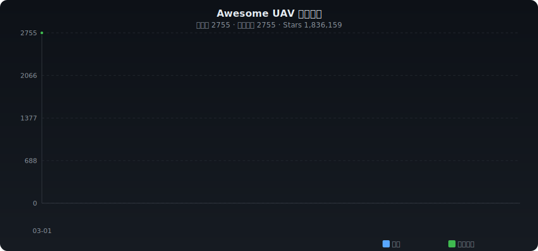

# ✨ Awesome UAV

[English](./README.md) | **中文**

> 无人机精选集合 —— 自主飞行、集群控制、路径规划、视觉导航、竞速等资源自动收录

   

---

## 📈 收录趋势

<p align="center"></p>

---

## 📊 分类统计

| 分类 | 数量 | 占比 |
|------|-----:|-----:|
| 🕹️ 飞行控制 | 442 | █████ 16.0% |
| 🗺️ 路径规划 & 导航 | 247 | ██ 9.0% |
| 🐝 集群 & 编队 | 178 | ██ 6.5% |
| 👁️ 视觉感知 & 检测 | 425 | █████ 15.4% |
| 📍 SLAM & 定位 | 71 | █ 2.6% |
| 🎯 强化学习 & 自主决策 | 242 | ██ 8.8% |
| 🏁 无人机竞速 | 70 | █ 2.5% |
| 🎮 仿真 & 数据集 | 219 | ██ 7.9% |
| 📦 物流 & 应用 | 31 | █ 1.1% |
| 🔧 硬件 & 通信 | 362 | ████ 13.1% |
| 🛡️ 反无人机 | 6 | █ 0.2% |
| 📦 其他 | 462 | █████ 16.8% |

---

## 🔥 每日热门 (2026-03-02)

| # | 项目 | ⭐ | 📈 日增 | 描述 |
|:-:|------|---:|-------:|------|
| 1 | [arpanghosh8453/open-dronelog](https://github.com/arpanghosh8453/open-dronelog) | 1,042 | +5 | 无人机记录分析器:是一个高性能的通用仪表板应用程序,用于在一个地方私下组织和分析DJI/Litchi... |
| 2 | [ArduPilot/ardupilot](https://github.com/ArduPilot/ardupilot) | 14,578 | +2 | 机器人,机器人,机器人,机器人 |
| 3 | [kousheekc/isaac_drone_racer](https://github.com/kousheekc/isaac_drone_racer) | 165 | +2 | 艾萨克无人机赛车是高速度自动驾驶无人机赛车的强化学习框架, |
| 4 | [lis-epfl/vswarm](https://github.com/lis-epfl/vswarm) | 84 | +2 | 基于视觉的无人机群体模拟和部署的ROS包 |
| 5 | [aau-cns/Ardupilot_Multiagent_Simulation](https://github.com/aau-cns/Ardupilot_Multiagent_Simulation) | 83 | +2 | 使用 Ardupilot,ROS 2 和 Gazebo 的多代理无人机系统的模拟环境,使用户能够在可... |
| 6 | [PX4/PX4-Autopilot](https://github.com/PX4/PX4-Autopilot) | 11,170 | +1 | 专用驾驶软件 |
| 7 | [iNavFlight/inav](https://github.com/iNavFlight/inav) | 3,969 | +1 | 航空航母:可导航的飞行控制软件 |
| 8 | [jyjblrd/Low-Cost-Mocap](https://github.com/jyjblrd/Low-Cost-Mocap) | 2,260 | +1 | 低成本的运动捕捉系统,用于室内尺度跟踪 |
| 9 | [mavlink/mavlink](https://github.com/mavlink/mavlink) | 2,182 | +1 | 无人机的通讯图书馆. |
| 10 | [utiasDSL/gym-pybullet-drones](https://github.com/utiasDSL/gym-pybullet-drones) | 1,857 | +1 | PyBullet Gymnasium环境,用于单机和多机器人增强学习四旋翼控制 |
| 11 | [mit-acl/faster](https://github.com/mit-acl/faster) | 1,196 | +1 | 在未知的环境中进行3D轨迹规划器 |
| 12 | [rtlopez/esp-fc](https://github.com/rtlopez/esp-fc) | 574 | +1 | 飞行控制器软件 - 专业化 - 建立自己的飞行控制器. |
| 13 | [mavlink-router/mavlink-router](https://github.com/mavlink-router/mavlink-router) | 567 | +1 | 路线和终端点之间的链接包 |
| 14 | [young-how/DQN-based-UAV-3D_path_planer](https://github.com/young-how/DQN-based-UAV-3D_path_planer) | 529 | +1 | 轮飞机 (RLGF) 是一个适合无人机深度增强学习任务的一般培训框架.并集成多个主流深度增强学习算法... |
| 15 | [OpenHUTB/hutb](https://github.com/OpenHUTB/hutb) | 441 | +1 | 人车模拟器 |
| 16 | [qqqlab/madflight](https://github.com/qqqlab/madflight) | 387 | +1 | 飞行控制器 ESP32 / Raspberry Pico / STM32 |
| 17 | [kitoweeknd/RFUAV](https://github.com/kitoweeknd/RFUAV) | 350 | +1 | 这是一个官方的文件库"RFUAV:无人机飞行器检测和识别的基准数据集".代码包括使用一些FFT/ST... |
| 18 | [aerostack2/aerostack2](https://github.com/aerostack2/aerostack2) | 304 | +1 | 机器人系统是ROS 2框架,旨在以简单而强大的方式创建自主多机机器人系统. |
| 19 | [opendroneid/opendroneid-core-c](https://github.com/opendroneid/opendroneid-core-c) | 293 | +1 | 开放无人机ID核心C库 |
| 20 | [KumarRobotics/kr_mav_control](https://github.com/KumarRobotics/kr_mav_control) | 147 | +1 | 四旋翼控制代码 |

---

## 📁 分类目录

- [🕹️ 飞行控制](#flight-control) (442)
- [🗺️ 路径规划 & 导航](#planning) (247)
- [🐝 集群 & 编队](#swarm) (178)
- [👁️ 视觉感知 & 检测](#perception) (425)
- [📍 SLAM & 定位](#slam) (71)
- [🎯 强化学习 & 自主决策](#rl) (242)
- [🏁 无人机竞速](#racing) (70)
- [🎮 仿真 & 数据集](#simulation) (219)
- [📦 物流 & 应用](#delivery) (31)
- [🔧 硬件 & 通信](#hardware) (362)
- [🛡️ 反无人机](#counter) (6)
- [📦 其他](#other) (462)

---

### <a id="flight-control"></a>🕹️ 飞行控制

| 项目 | ⭐ | 语言 | 描述 |
|------|---:|:----:|------|
| [betaflight/betaflight](https://github.com/betaflight/betaflight) | 10,651 | C | 开源飞行控制器固件 |
| [gyroflow/gyroflow](https://github.com/gyroflow/gyroflow) | 8,273 | Rust | 使用陀螺镜数据的视频稳定 |
| [facontidavide/PlotJuggler](https://github.com/facontidavide/PlotJuggler) | 5,731 | C++ | 你应该得到的时间系列视觉工具. |
| [mavlink/qgroundcontrol](https://github.com/mavlink/qgroundcontrol) | 4,378 | C++ | 无人机 (Android,iOS,Mac OS,Linux,Windows) 跨平台地面控制站 |
| [iNavFlight/inav](https://github.com/iNavFlight/inav) | 3,969 | C | 航空航母:可导航的飞行控制软件 |
| [inavFlight/inav](https://github.com/iNavFlight/inav) | 3,968 | C | 航空航母:可导航的飞行控制软件 |
| [cleanflight/cleanflight](https://github.com/cleanflight/cleanflight) | 2,713 | C | 基本飞行飞行控制器固件的清洁代码版本 |
| [but0n/Avem](https://github.com/but0n/Avem) | 2,676 | C |  轻量级无人机飞控-[无人机]-[STM32]-[PID]-[BLDC] |
| [ArduPilot/MissionPlanner](https://github.com/ArduPilot/MissionPlanner) | 2,176 | C# | 任务规划者陆地控制站 (c# .net) |
| [generalized-intelligence/GAAS](https://github.com/generalized-intelligence/GAAS) | 2,045 | C++ | 美国航空航天局 (GAAS) 是一个为全自动驾驶VTOL (也称为飞行汽车) 和无人机设计的开源程序. |
| [ethz-adrl/control-toolbox](https://github.com/ethz-adrl/control-toolbox) | 1,662 | C++ | 控制工具箱 - - 机器人,最佳和模型预测控制的开源C++图书馆 |
| [nickrehm/dRehmFlight](https://github.com/nickrehm/dRehmFlight) | 1,349 | C++ | 对于小型VTOL车辆的Teensy/Arduino飞行控制器和稳定 |
| [pixhawk/Hardware](https://github.com/pixhawk/Hardware) | 1,273 | Shell | 硬件设计 |
| [TinyMPC/TinyMPC](https://github.com/TinyMPC/TinyMPC) | 995 | C++ | 微控制器模型预测控制 |
| [dji-sdk/Onboard-SDK](https://github.com/dji-sdk/Onboard-SDK) | 971 | C++ | 官方存储库 |
| [dji-sdk/onboard](https://github.com/dji-sdk/Onboard-SDK) | 971 | C++ | 官方存储库 |
| [okalachev/flix](https://github.com/okalachev/flix) | 810 | C++ | 从零开始制造基于ESP32的四旋翼 |
| [cyphunk/JTAGenum](https://github.com/cyphunk/JTAGenum) | 786 | C++ | 由于一个兼容Arduino的微控制器或果PI (实验),JTAGenum扫描针[]基本JTAG功能,可以用来列出无证指令的指令登记.JTAG... |
| [iNavFlight/inav-configurator](https://github.com/iNavFlight/inav-configurator) | 742 | JavaScript |  |
| [Robotics-STAR-Lab/RACER](https://github.com/Robotics-STAR-Lab/RACER) | 722 | C++ | 快速探测多架无人机 (UAV) |
| [PX4/PX4-Avoidance](https://github.com/PX4/PX4-Avoidance) | 721 | C++ | 防范PX4障碍检测和防范的ROS节点. |
| [olliw42/storm32bgc](https://github.com/olliw42/storm32bgc) | 714 | C++ | 基于STM323232位微控制器的3轴无刷式杆控制器 |
| [hanyazou/TelloPy](https://github.com/hanyazou/TelloPy) | 708 | Python | 无人机控制器 python包 |
| [betaflight/betaflight-tx-lua-scripts](https://github.com/betaflight/betaflight-tx-lua-scripts) | 691 | Lua | 收集从你的TX配置Betaflight的脚本 (目前仅支持OpenTx) |
| [ArduPilot/pymavlink](https://github.com/ArduPilot/pymavlink) | 676 | Python | python MAVLink接口和工具 |
| [bw1129/PIDtoolbox](https://github.com/bw1129/PIDtoolbox) | 641 | MATLAB |  PIDtoolbox 是分析黑盒日志数据的图形工具集 |
| [ArduPilot/ardupilot_wiki](https://github.com/ArduPilot/ardupilot_wiki) | 605 | Python | 维基问题库和特定维基网站基础设施. |
| [sieuwe1/Autonomous-Ai-drone-scripts](https://github.com/sieuwe1/Autonomous-Ai-drone-scripts) | 576 | Python | 通过AI,计算机视觉,Lidar和GPS来控制基于升机的四旋翼直升机的最新自动导航脚本. |
| [rtlopez/esp-fc](https://github.com/rtlopez/esp-fc) | 574 | C++ | 飞行控制器软件 - 专业化 - 建立自己的飞行控制器. |
| [ArduPilot/MAVProxy](https://github.com/ArduPilot/MAVProxy) | 556 | Python | 据MAVLink代理和命令线地面站 |
| [ArduPilot/apm_planner](https://github.com/ArduPilot/apm_planner) | 547 | C++ | 美国国家安全局 (APM Planner Ground Control Station) |
| [yaapu/FrskyTelemetryScript](https://github.com/yaapu/FrskyTelemetryScript) | 540 | Lua | 通过ArduPilot frsky passthrru协议使用Horus X10(S),X12和Taranis X9D+,X9E,QX7和X... |
| [PX4/PX4-ECL](https://github.com/PX4/PX4-ECL) | 530 | C++ | 预测和控制图书馆指导,导航和控制应用程序 |
| [multiwii/baseflight](https://github.com/multiwii/baseflight) | 522 | C | 双维机 RC飞行控制器固件的32位叉 |
| [Jaeyoung-Lim/mavros_controllers](https://github.com/Jaeyoung-Lim/mavros_controllers) | 496 | C++ | 采用PX4启用车辆的马沃斯进行攻击轨迹跟踪 |
| [emuflight/EmuFlight](https://github.com/emuflight/EmuFlight) | 488 | C | 飞行器是飞行控制器软件 (固件),用于飞行多轮机. |
| [dji-sdk/Payload-SDK](https://github.com/dji-sdk/Payload-SDK) | 463 | C | 官方存储库 |
| [ShikOfTheRa/scarab-osd](https://github.com/ShikOfTheRa/scarab-osd) | 445 | C | 机器人机械设备 |
| [PX4/PX4-user_guide](https://github.com/PX4/PX4-user_guide) | 417 | Jupyter Notebook | PX4用户指南来源 (档案) |
| [Plasmatree/PID-Analyzer](https://github.com/Plasmatree/PID-Analyzer) | 417 | Python |  |

---

### <a id="planning"></a>🗺️ 路径规划 & 导航

| 项目 | ⭐ | 语言 | 描述 |
|------|---:|:----:|------|
| [HKUST-Aerial-Robotics/Fast-Planner](https://github.com/HKUST-Aerial-Robotics/Fast-Planner) | 3,194 | C++ | 四旋翼的强大而有效的轨迹规划器 |
| [jonyzhang2023/awesome-embodied-vla-va-vln](https://github.com/jonyzhang2023/awesome-embodied-vla-va-vln) | 2,610 | - | 精选的AI最新研究列表,重点关注视觉语言行动 (VLA) 模型,视觉语言导航 (VLN) 和相关的多模式学习方法. |
| [HKUST-Aerial-Robotics/FUEL](https://github.com/HKUST-Aerial-Robotics/FUEL) | 1,343 | C++ | 快速探测无人机的有效框架 |
| [mit-acl/faster](https://github.com/mit-acl/faster) | 1,196 | C++ | 在未知的环境中进行3D轨迹规划器 |
| [ZJU-FAST-Lab/GCOPTER](https://github.com/ZJU-FAST-Lab/GCOPTER) | 1,167 | C++ | 对于多升机的通用轨道优化器 |
| [HKUST-Aerial-Robotics/Teach-Repeat-Replan](https://github.com/HKUST-Aerial-Robotics/Teach-Repeat-Replan) | 1,126 | C++ | 教导重复重复:在复杂环境中进行侵略飞行的完整和强大的系统 |
| [yrlu/quadrotor](https://github.com/yrlu/quadrotor) | 1,087 | MATLAB | 四旋翼控制,路径规划和轨迹优化 |
| [hungpham2511/toppra](https://github.com/hungpham2511/toppra) | 841 | Python | 机器人运动规划图书馆 |
| [Zhefan-Xu/CERLAB-UAV-Autonomy](https://github.com/Zhefan-Xu/CERLAB-UAV-Autonomy) | 775 | C++ | [CMU]为自动驾驶无人机 (UAV) 设计的多功能和模块化框架 (C++/ROS/PX4) |
| [KumarRobotics/kr_autonomous_flight](https://github.com/KumarRobotics/kr_autonomous_flight) | 754 | C++ | 无线路检测器 (GPS) 无线路检测器自动飞行系统 |
| [zhaohaojie1998/Grey-Wolf-Optimizer-for-Path-Planning](https://github.com/zhaohaojie1998/Grey-Wolf-Optimizer-for-Path-Planning) | 704 | MATLAB | 灰狼优化算法(GWO) 路径规划/轨迹规划/轨迹优化、多智能体/多无人机航迹规划 |
| [ethz-asl/mav_active_3d_planning](https://github.com/ethz-asl/mav_active_3d_planning) | 684 | C++ | 网络信息路径规划的模块化框架. |
| [henbudidiao/UAV-path-planning](https://github.com/henbudidiao/UAV-path-planning) | 661 | Python | 基于深度增强学习的多/单机无人机 (无人机) 航行路径规划 |
| [ethz-asl/mav_trajectory_generation](https://github.com/ethz-asl/mav_trajectory_generation) | 645 | C++ | 聚项目的轨道生成和优化,特别是在旋翼MAV中. |
| [pulp-platform/pulp-dronet](https://github.com/pulp-platform/pulp-dronet) | 585 | C | 通过深度学习驱动的视觉导航引擎,可实现口尺寸四旋翼自动导航 - 运行在PULP上 |
| [HKUST-Aerial-Robotics/Btraj](https://github.com/HKUST-Aerial-Robotics/Btraj) | 502 | C++ | 独立四旋翼的贝齐尔轨迹生成,ICRA 2018 |
| [jzstudent/UAV-auto-navigation-and-object-tracking-based-on-RL](https://github.com/jzstudent/UAV-auto-navigation-and-object-tracking-based-on-RL) | 463 | C++ | 毕业设计的代码部分,实现了UE4和空气环境下无人机自主导和目标跟踪的强化学习算法. |
| [ethz-asl/mav_control_rw](https://github.com/ethz-asl/mav_control_rw) | 427 | C | 使用ROS的旋翼微型飞行器控制策略 |
| [ayushgaud/path_planning](https://github.com/ayushgaud/path_planning) | 411 | C++ | 使用RRT*和最低射轨道生成的四旋翼路径规划 |
| [caochao39/aerial_navigation_development_environment](https://github.com/caochao39/aerial_navigation_development_environment) | 399 | C++ | 利用系统开发和机器人部署用于自动驾驶航行. |
| [VladyslavUsenko/ewok](https://github.com/VladyslavUsenko/ewok) | 381 | C++ | 基于B-splines和3D圆形缓冲的MAV的实时轨迹重定计划 |
| [peiyu-cui/uav_motion_planning](https://github.com/peiyu-cui/uav_motion_planning) | 366 | C++ | 无人机运动规划路径规划A*,动力 A*,RRT,RRT*,SE(3)规划,最小快速 |
| [xumeng367/DroneDetour](https://github.com/xumeng367/DroneDetour) | 363 | Java | 无人机路径规划和自动绕行导航的Java图书馆和Android演示.它计算了多角无人机禁飞区周围最短的安全路线 |
| [HKUST-Aerial-Robotics/FC-Planner](https://github.com/HKUST-Aerial-Robotics/FC-Planner) | 337 | C++ | 国际航空航天局24年最佳无人机论文奖获得者 |
| [ZJU-FAST-Lab/Fast-Racing](https://github.com/ZJU-FAST-Lab/Fast-Racing) | 308 | C++ | 开源的强大基础标准 (SE) 3) 自主无人机赛车规划 |
| [Zhefan-Xu/Intent-MPC](https://github.com/Zhefan-Xu/Intent-MPC) | 305 | C++ | [IEEE RA-L'25] 动态环境中无人机规划和导航的预测模型预测控制 (C++/ROS) |
| [TIERS/wildnav](https://github.com/TIERS/wildnav) | 249 | Python | 无人机在野生环境中无 GNSS 导航和定位 |
| [hku-mars/IPC](https://github.com/hku-mars/IPC) | 239 | C++ | 随着突发的过渡物体和干扰的出现,四旋翼导航的综合规划和控制 |
| [HaiderAbasi/ROS2-Path-Planning-and-Maze-Solving](https://github.com/HaiderAbasi/ROS2-Path-Planning-and-Maze-Solving) | 229 | Python | 在ROS2开发一个迷宫解决机器人,利用使用OpenCV算法从无人机或卫星摄像头中获取信息, |
| [tum-vision/tum_ardrone](https://github.com/tum-vision/tum_ardrone) | 228 | C++ | _ardrone ROS包存储库,实现了Prot AR.Drone的基于PTAM的视觉导航的自动飞行. |
| [mit-acl/panther](https://github.com/mit-acl/panther) | 221 | C++ | 动态环境中的感知知轨迹规划器 |
| [LenaShengzhen/AerialRobotics](https://github.com/LenaShengzhen/AerialRobotics) | 202 | MATLAB | 模拟四旋翼/无人机的路径规划和轨迹规划. |
| [XXLiu-HNU/visualize_uav_trajectory](https://github.com/XXLiu-HNU/visualize_uav_trajectory) | 198 | Python | 在视频中可视化无人机的轨迹 |
| [Robotics-STAR-Lab/EPIC](https://github.com/Robotics-STAR-Lab/EPIC) | 194 | C++ | 在点云上探索:基于Lidar的轻量级无人机探索框架用于大规模场景 |
| [ZJU-FAST-Lab/am_traj](https://github.com/ZJU-FAST-Lab/am_traj) | 194 | C++ | 基于最小化的轨道生成替代四旋翼侵略飞行 |
| [szebedy/autonomous-drone](https://github.com/szebedy/autonomous-drone) | 187 | C++ | 该库旨在通过英特尔AeroRTF无人机和PX4自动驾驶员实现自动驾驶飞机的交付.该代码可以在真实无人机上执行或在使用Gazebo的PC上模拟... |
| [YouhuiGan/UAV_DDPG](https://github.com/YouhuiGan/UAV_DDPG) | 186 | Python | 无人机辅助MEC系统中的轨道优化和计算卸载战略 |
| [ethz-asl/terrain-navigation](https://github.com/ethz-asl/terrain-navigation) | 183 | C++ | 固定翼飞行器在坡地带安全低海拔导航的实施 |
| [Gongyihang/Motion-Planning](https://github.com/Gongyihang/Motion-Planning) | 177 | - | 书籍和论文 ((主要是关于无人机和中核电站问题) |
| [ika-rwth-aachen/drone-dataset-tools](https://github.com/ika-rwth-aachen/drone-dataset-tools) | 172 | Python | 为了实现这些目标,我们提供了Python的源代码,允许数据集的进口和可视化. |

---

### <a id="swarm"></a>🐝 集群 & 编队

| 项目 | ⭐ | 语言 | 描述 |
|------|---:|:----:|------|
| [uavorg/uavstack](https://github.com/uavorg/uavstack) | 711 | Java | 无人机存机 (UAVStack) 开源所有在一个存储库 |
| [sensepost/Snoopy](https://github.com/sensepost/Snoopy) | 612 | Python | 斯诺皮:分布式跟踪和数据拦截框架 |
| [wangwei39120157028/UAVS](https://github.com/wangwei39120157028/UAVS) | 552 | JavaScript | 智能无人机路径规划模拟系统是一个软件,具有精细的操作控制,强大的平台集成,全方向模型构建和应用自动化.它将A和B之间的无人机战役在C区作为背... |
| [lijx10/uwb-localization](https://github.com/lijx10/uwb-localization) | 410 | C++ | 通过UWB和IMU融合对MAV群体的精确3D定位.ICCA 2018 |
| [USC-ACTLab/crazyswarm](https://github.com/USC-ACTLab/crazyswarm) | 365 | Python | 大型四旋翼群 |
| [lis-epfl/swarmlab](https://github.com/lis-epfl/swarmlab) | 292 | MATLAB | 无人机群组模拟的多功能Matlab包. |
| [reinshift/MADDPG_Multi_UAV_Roundup](https://github.com/reinshift/MADDPG_Multi_UAV_Roundup) | 257 | Python | 基于MADDPG的多无人机目标组合 |
| [Robotics-STAR-Lab/SOAR](https://github.com/Robotics-STAR-Lab/SOAR) | 216 | C++ | 为了快速自主重建,一个多型无人机计划器 |
| [hbayerlein/uav_data_harvesting](https://github.com/hbayerlein/uav_data_harvesting) | 211 | Python | 通过Python实现DDQN多无人机数据收集 |
| [robin-shaun/Multi-UAV-Task-Assignment-Benchmark](https://github.com/robin-shaun/Multi-UAV-Task-Assignment-Benchmark) | 189 | Python | 扩展团队定向问题的多无人机任务分配基准 |
| [SysuUavFormation/UAV_Formation_Ground_Station](https://github.com/SysuUavFormation/UAV_Formation_Ground_Station) | 188 | C++ | 室外基于GPS的无人机分布式编队避难飞行 |
| [AlexJinlei/Autonomous_UAVs_Swarm_Mission](https://github.com/AlexJinlei/Autonomous_UAVs_Swarm_Mission) | 185 | Python |  |
| [SJTUwbl/MaCA](https://github.com/SJTUwbl/MaCA) | 161 | Python | 多特工战场 (无人机群与无人机群) |
| [thu-uav/Multi-UAV-pursuit-evasion](https://github.com/thu-uav/Multi-UAV-pursuit-evasion) | 151 | Python | 通过深度增强学习在未知的环境中进行在线规划的多无人机追逐-逃避 |
| [zeyang23/Formation-Control](https://github.com/zeyang23/Formation-Control) | 151 | MATLAB | 无人机的时间变化形成控制 |
| [WilliamFun/UAV_swarm_3d_simulation](https://github.com/WilliamFun/UAV_swarm_3d_simulation) | 137 | MATLAB | 基于领导者跟随者和人工潜力的无人机协调形成控制模拟 |
| [heartxuxuxu/Formation_Flight_Sim](https://github.com/heartxuxuxu/Formation_Flight_Sim) | 127 | Matlab | 四旋翼形成控制模拟,包括目标分配,全球路径规划和地方路径规划 |
| [Sen2Agri/Sen2Agri-System](https://github.com/Sen2Agri/Sen2Agri-System) | 127 | HTML | 农业卫星-2 (Sen2Agri) 是由欧洲太空局 (欧洲空间局) 资助的农业目的高分辨率卫星图像处理软件系统. |
| [gtfactslab/CrazySim](https://github.com/gtfactslab/CrazySim) | 127 | - | 通过Crazyswarm2测试CFLib Python代码,ROS 2节点,定制的疯狂飞机固件模块,或在疯狂飞机python客户端进行飞行演... |
| [skybrush-io/skybrush-server](https://github.com/skybrush-io/skybrush-server) | 113 | Python | 开源无人机光秀和无人机群管理框架的Skybrush服务器组件 |
| [gustavoavellar/multi-uav-planning](https://github.com/gustavoavellar/multi-uav-planning) | 110 | Matlab | 这是一个使用在论文中使用的matlab代码多无人机路由区域覆盖和远程传感的最小时间 |
| [LYSJ-feng/mCPP-based-on-MADDPG](https://github.com/LYSJ-feng/mCPP-based-on-MADDPG) | 108 | - | 建立了10*10网和4架无人机的环境,以合作开展覆盖路径规划 |
| [skybrush-io/live](https://github.com/skybrush-io/live) | 106 | TypeScript | 开源无人机展示和无人机群地面控制站GUI前端 |
| [monemati/multiuav-gazebo-simulation](https://github.com/monemati/multiuav-gazebo-simulation) | 102 | Shell | 关于在加塞波和阿尔杜飞机中进行多无人机 (四旋翼) 模拟的教程. |
| [JohannesAutenrieb/mission_planning](https://github.com/JohannesAutenrieb/mission_planning) | 95 | Python | 任务规划和任务分配 - 团队A为BAE系统无人机群集团项目 |
| [jerryfungi/Multi-UAV_Task_Allocation_SEADmission](https://github.com/jerryfungi/Multi-UAV_Task_Allocation_SEADmission) | 93 | Python | 多无人机任务分配 |
| [tianbot/abc_swarm](https://github.com/tianbot/abc_swarm) | 92 | Python | 蜂合作群,表示空地合作. 这里是天迷你和机器人主导TT群的库. |
| [Rajshah05/UAV-swarm-control-optimization](https://github.com/Rajshah05/UAV-swarm-control-optimization) | 89 | MATLAB | 通过优化反控制收益/参数,在存在障碍的情况下降低无人机群导航形成控制的定位时间. |
| [sisl/MultiAgentAllocationTransit.jl](https://github.com/sisl/MultiAgentAllocationTransit.jl) | 89 | Julia | 通过交通网络进行高效的大型多无人机交付 |
| [sangwoomoon/multiple_UAVs](https://github.com/sangwoomoon/multiple_UAVs) | 88 | Matlab | 连接机器的等级多代理系统 |
| [damwhit/harvest_helper](https://github.com/damwhit/harvest_helper) | 88 | Ruby | 提供了数据库中的45种植物的种植,收获和食谱信息, |
| [afrl-rq/OpenAMASE](https://github.com/afrl-rq/OpenAMASE) | 87 | Java | 模拟多无人机任务项目 |
| [lis-epfl/vswarm](https://github.com/lis-epfl/vswarm) | 84 | Python | 基于视觉的无人机群体模拟和部署的ROS包 |
| [PulkitRustagi/UWB-Localization](https://github.com/PulkitRustagi/UWB-Localization) | 81 | Python | 高精度多代理 UWB定位,用于在无人机和UGV系统合作,在无GPS环境中准确定位. |
| [afrl-rq/OpenUxAS-SoI](https://github.com/afrl-rq/OpenUxAS-SoI) | 80 | C++ | 多无人机合作决策项目 |
| [UPatras-ANeMoS/UAV_coverage](https://github.com/UPatras-ANeMoS/UAV_coverage) | 76 | MATLAB | 无人机群的平面面覆盖模拟 |
| [duynamrcv/rbf_bsmc](https://github.com/duynamrcv/rbf_bsmc) | 75 | MATLAB | 适应性控制多架无人机的形成,应对外部干扰 |
| [zzycoder/Cooperative-Attack-Algorithm-for-UAVs](https://github.com/zzycoder/Cooperative-Attack-Algorithm-for-UAVs) | 74 | MATLAB | 无人机合作攻击算法主要关注无人机群系统的合作攻击问题,其飞行时间和攻击角度限制. |
| [mit-acl/aclswarm](https://github.com/mit-acl/aclswarm) | 72 | C++ | 通过多轮机飞行的MIT ACL分布式形成 |
| [linqingbh/Consensus-based-DMPC](https://github.com/linqingbh/Consensus-based-DMPC) | 72 | - | 基于共识的多架固定翼无人机控制使用分布式模型预测控制 |

---

### <a id="perception"></a>👁️ 视觉感知 & 检测

| 项目 | ⭐ | 语言 | 描述 |
|------|---:|:----:|------|
| [ultralytics/yolov5](https://github.com/ultralytics/yolov5) | 56,888 | Python | 在 PyTorch > ONNX > CoreML > TFLite 中 |
| [AlexeyAB/darknet](https://github.com/AlexeyAB/darknet) | 22,194 | C | 约洛夫4 / 规模化约洛夫4 / 约洛 - 对象检测神经网络 (Windows和Linux版本的暗网) |
| [satellite-image-deep-learning/techniques](https://github.com/satellite-image-deep-learning/techniques) | 10,034 | - | 通过卫星和空中图像进行深度学习的技术 |
| [ifzhang/ByteTrack](https://github.com/FoundationVision/ByteTrack) | 6,100 | Python | [ECCV 2022] 字节轨迹:通过将每个检测盒连接到多个对象的跟踪 |
| [nwojke/deep_sort](https://github.com/nwojke/deep_sort) | 6,073 | Python | 简单的在线实时跟踪,使用深度的协会指标 |
| [OpenDroneMap/ODM](https://github.com/OpenDroneMap/ODM) | 5,867 | Python | 通过无人机,气球或飞图像生成地图,点云,3D模型和DEM的命令行工具包. |
| [OpenDroneMap/OpenDroneMap](https://github.com/OpenDroneMap/ODM) | 5,867 | Python | 通过无人机,气球或飞图像生成地图,点云,3D模型和DEM的命令行工具包. |
| [abewley/sort](https://github.com/abewley/sort) | 4,334 | Python | 简单,在线,实时跟踪视频序列中的多个对象. |
| [ifzhang/FairMOT](https://github.com/ifzhang/FairMOT) | 4,230 | Python | [IJCV-2021] 公平性:多个物体跟踪的检测和重新识别 |
| [jyjblrd/Low-Cost-Mocap](https://github.com/jyjblrd/Low-Cost-Mocap) | 2,260 | TypeScript | 低成本的运动捕捉系统,用于室内尺度跟踪 |
| [VisDrone/VisDrone-Dataset](https://github.com/VisDrone/VisDrone-Dataset) | 2,114 | - | 基于无人机的检测和跟踪数据集,包括图像/视频和注释. |
| [deepmind/tapnet](https://github.com/google-deepmind/tapnet) | 1,804 | Jupyter Notebook | 追踪任何点 (TAP) |
| [luanshiyinyang/awesome-multiple-object-tracking](https://github.com/luanshiyinyang/awesome-multiple-object-tracking) | 1,452 | - | 多个物体跟踪 (MOT) 的资源 |
| [xuannianz/EfficientDet](https://github.com/xuannianz/EfficientDet) | 1,451 | Python | 在Keras和Tensorflow中实现EfficientDet (可扩展和有效的对象检测) |
| [satellite-image-deep-learning/datasets](https://github.com/satellite-image-deep-learning/datasets) | 1,090 | - | 通过卫星和空中图像进行深度学习的数据集 |
| [WangLibo1995/GeoSeg](https://github.com/WangLibo1995/GeoSeg) | 1,042 | Python | 联合国特形式器:用于远程传感城市场景图像的高效语义分类的UNet类似变压器,ISPRS. 还包括其他视觉变压器和卫星,空中图像和无人机图像分... |
| [arpanghosh8453/open-dronelog](https://github.com/arpanghosh8453/open-dronelog) | 1,042 | TypeScript | 无人机记录分析器:是一个高性能的通用仪表板应用程序,用于在一个地方私下组织和分析DJI/Litchi飞行记录. |
| [SysCV/sam-pt](https://github.com/SysCV/sam-pt) | 1,035 | Python | 扩展SAM到零镜头视频分区,以点式跟踪. |
| [rodizio1/EZ-WifiBroadcast](https://github.com/rodizio1/EZ-WifiBroadcast) | 892 | C | 价格便宜的数字高清视频传输变得简单! |
| [chrieke/awesome-geospatial-companies](https://github.com/chrieke/awesome-geospatial-companies) | 838 | Python | :glob_with_meridians: 地质空间工作的700多家公司的清单和地图 (GIS,地球观测,无人机,卫星,数字农业, ..) |
| [uzh-rpg/rpg_quadrotor_control](https://github.com/uzh-rpg/rpg_quadrotor_control) | 696 | C++ | 机器人和感知集团开发的四旋翼控制框架 |
| [VisDrone/DroneVehicle](https://github.com/VisDrone/DroneVehicle) | 665 | - | 通过无人机使用无人机的RGB-红外跨模式车辆检测,通过不确定性意识的学习 |
| [yuanmaoxun/Awesome-RGBT-Fusion](https://github.com/yuanmaoxun/Awesome-RGBT-Fusion) | 655 | - | 基于深度学习的RGB-T-Fusion方法,代码和数据集.涉及的主要方向是多谱步行者检测,RGB-T空中物体检测,RGB-T语义分区,RGB... |
| [timmeinhardt/trackformer](https://github.com/timmeinhardt/trackformer) | 623 | Python | 实施"TrackFormer:多对象跟踪与变压器. [计算机视觉和模式识别会议 (CVPR), 2022] |
| [layumi/University1652-Baseline](https://github.com/layumi/University1652-Baseline) | 611 | Python | 据悉,该大学的建筑物和建筑物均为1652座. |
| [ctu-mrs/mrs_uav_system](https://github.com/ctu-mrs/mrs_uav_system) | 575 | Shell | 进入MRS无人机系统的入口点. |
| [time4tea/gopro-dashboard-overlay](https://github.com/time4tea/gopro-dashboard-overlay) | 535 | Python | 处理GoPro MP4 和通用GPX/FIT文件和创建视频仪表板和地图的程序 |
| [HKUST-Aerial-Robotics/OmniNxt](https://github.com/HKUST-Aerial-Robotics/OmniNxt) | 508 | - | 完全开源和紧的空中机器人,具有全方向视觉感知 |
| [uzh-rpg/rpg_mpc](https://github.com/uzh-rpg/rpg_mpc) | 486 | C | 模型四旋翼预测控制,扩展到知觉MPC |
| [yijingru/BBAVectors-Oriented-Object-Detection](https://github.com/yijingru/BBAVectors-Oriented-Object-Detection) | 477 | Python | 导向物体检测在空中图像中,使用盒子边界意识向量 |
| [dlktdr/HeadTracker](https://github.com/headtracker/HeadTracker) | 451 | C++ | 这项项目是为了记录方向的FPV耳机,让你的RC上的相机跟踪你的头部运动. |
| [csuhan/ReDet](https://github.com/csuhan/ReDet) | 424 | Python | 官方文件代码"ReDet:用于空中物体检测的旋转等式检测仪" (CVPR 2021) |
| [Ank-Cha/Social-Distancing-Analyser-COVID-19](https://github.com/Ank-Cha/Social-Distancing-Analyser-COVID-19) | 413 | Python | 通过视频监控 CCTV 摄像头和无人机来调节社交距离协议的AI工具. |
| [ANG13T/DroneXtract](https://github.com/ANG13T/DroneXtract) | 344 | Go | 无人机测试器 (DroneXtract) 是一个用于 DJI无人机的数字法医套件. |
| [kinivi/tello-gesture-control](https://github.com/kinivi/tello-gesture-control) | 334 | Python | 通过使用无人机的摄像头视频流上的手势识别来控制DJI Tello . |
| [monemati/PX4-ROS2-Gazebo-YOLOv8](https://github.com/monemati/PX4-ROS2-Gazebo-YOLOv8) | 315 | Python | 通过PX4自动驾驶机和ROS 2.PX4SITL和Gazebo Garden用于模拟.YOLOv8用于对象检测. |
| [roboflow/dji-aerial-georeferencing](https://github.com/roboflow/dji-aerial-georeferencing) | 312 | JavaScript | 检测无人机视频中的物体,并将它们绘制在地图上 |
| [micasense/imageprocessing](https://github.com/micasense/imageprocessing) | 292 | Jupyter Notebook | 微信红边和Altum图像处理教程 |
| [yhlleo/DeepCrack](https://github.com/yhlleo/DeepCrack) | 288 | - | 深:一个深层次层次特征学习架构,用于裂分区,神经计算. |
| [LiWentomng/OrientedRepPoints](https://github.com/LiWentomng/OrientedRepPoints) | 280 | Python | 航空物体检测导向反射点 (CVPR 2022) 代码 |

---

### <a id="slam"></a>📍 SLAM & 定位

| 项目 | ⭐ | 语言 | 描述 |
|------|---:|:----:|------|
| [UZ-SLAMLab/ORB_SLAM3](https://github.com/UZ-SLAMLab/ORB_SLAM3) | 8,325 | C++ | ORB-SLAM3:视觉,视觉内动和多地图SLAM的准确的开源库 |
| [openMVG/openMVG](https://github.com/openMVG/openMVG) | 6,302 | C++ | 开放多视图几何库,为3D计算机视觉和结构从动作提供基础. |
| [OpenDroneMap/WebODM](https://github.com/OpenDroneMap/WebODM) | 3,698 | Python | 易于使用的商业级软件,用于处理空中图像. ️ |
| [rpng/open_vins](https://github.com/rpng/open_vins) | 2,761 | C++ | 开源平台用于视觉惰导航研究. |
| [KumarRobotics/msckf_vio](https://github.com/KumarRobotics/msckf_vio) | 1,913 | C++ | 强大的静音视觉惯性体仪器用于快速自动飞行 |
| [mikeroyal/Photogrammetry-Guide](https://github.com/mikeroyal/Photogrammetry-Guide) | 1,440 | Python | 摄影仪指南.摄影仪广泛用于空气测量,农业,建筑,3D游戏,机器人,考古学,建筑,紧急管理和医疗. |
| [PetWorm/LARVIO](https://github.com/PetWorm/LARVIO) | 788 | C++ | 基于多州限制卡尔曼过器的轻量,精确和强大的单眼视觉惯性仪. |
| [HKUST-Aerial-Robotics/FIESTA](https://github.com/HKUST-Aerial-Robotics/FIESTA) | 780 | C++ | 飞机机器人的在线运动规划的快速增长式尤克利德距离场 |
| [HKUST-Aerial-Robotics/DenseSurfelMapping](https://github.com/HKUST-Aerial-Robotics/DenseSurfelMapping) | 706 | C++ | 这是ICRA2019提交的"实时可扩展密度冲击地图"的开源版本 |
| [mathiasmantelli/awesome-mobile-robotics](https://github.com/mathiasmantelli/awesome-mobile-robotics) | 674 | - | 有关AI,计算机视觉和机器人技术的不同内容的有用链接. |
| [ethz-asl/aerial_mapper](https://github.com/ethz-asl/aerial_mapper) | 608 | C++ | 实时密集点云,无人机数字表面地图 (DSM) 和 (奥尔多-) 摩赛克生成 |
| [hku-mars/Swarm-LIO2](https://github.com/hku-mars/Swarm-LIO2) | 409 | C++ | 无人机群体的分散,高效的LIDAR惰性测 |
| [zdzhaoyong/Map2DFusion](https://github.com/zdzhaoyong/Map2DFusion) | 365 | C++ | 这是一个开源的纸质应用:基于单光SLAM的实时增量无人机图像图像. |
| [thien94/vision_to_mavros](https://github.com/thien94/vision_to_mavros) | 288 | Python | 集合了基于视觉系统 (如信托标签,VIO,SLAM或深度图像等外部本地化系统) 的ROS和非ROS (Python) 代码,将数据转换为可用... |
| [DroneDB/DroneDB](https://github.com/DroneDB/DroneDB) | 259 | C++ | 免费和开源软件用于地质空间数据存储. |
| [uzh-rpg/learned_inertial_model_odometry](https://github.com/uzh-rpg/learned_inertial_model_odometry) | 252 | Python | 本备忘录包含了论文"自动无人机赛车学习惯性测",RA-L 2023的代码. |
| [tentone/tello-ros2](https://github.com/tentone/tello-ros2) | 208 | C++ | 对于 DJI Tello 和 Visual SLAM 的 ROS2 节点,用于室内环境的映射. |
| [Liansheng-Wang/faster_lio_localization](https://github.com/Liansheng-Wang/faster_lio_localization) | 189 | C++ | 体中-360 用于基于无人机的快速. 在内置地图中添加定位模式. |
| [LTU-RAI/Map-Conversion-3D-Voxel-Map-to-2D-Occupancy-Map](https://github.com/LTU-RAI/Map-Conversion-3D-Voxel-Map-to-2D-Occupancy-Map) | 167 | C++ | 转换由UFOMap和OctoMap地图解决方案生成的3D语音图为无人机和无人地面车 (UGV) 的2D占用地图的ROS包 |
| [hmgoforth/gps-denied-uav-localization](https://github.com/hmgoforth/gps-denied-uav-localization) | 155 | Python |  |
| [zjz0001/LIO-Drone-250](https://github.com/zjz0001/LIO-Drone-250) | 138 | C++ | 这里可以使用中360的无人机飞行,它包含了Fast-LIO2的远程测量参考和Ego-Planner的规划模块参考. |
| [tau-adl/Position-Control-Using-ORBSLAM2-on-the-Jetson-Nano](https://github.com/tau-adl/Position-Control-Using-ORBSLAM2-on-the-Jetson-Nano) | 107 | C++ | 在Jetson Nano上运行ORBSLAM2,使用记录的囊 (例如,EUROC) 或从Bebop2无人机中录制的现场录像 |
| [TJUUAVLaboratory/ethz_asl_UAV_autonomous](https://github.com/TJUUAVLaboratory/ethz_asl_UAV_autonomous) | 102 | C++ | 苏黎世工业开源的全套自主无人机系统 |
| [TIERS/uwb-drone-dataset](https://github.com/TIERS/uwb-drone-dataset) | 95 | C | 超宽带 (UWB) 在GNSS被拒绝的环境中自动驾驶无人机飞行定位 |
| [zhan994/AgriLiRa4D](https://github.com/zhan994/AgriLiRa4D) | 83 | - | 农业Ra4D:多传感器无人机数据集,用于挑战农业领域的强大的SLAM |
| [bandofpv/VSLAM-UAV](https://github.com/bandofpv/VSLAM-UAV) | 82 | Shell | 无人机无人机无人机无人机无人机无人机无人机无人机无人机无人机无人机无人机无人机无人机无人机无人机无人机无人机无人机无人机无人机无人机无人机无... |
| [MetaSLAM/ALTO](https://github.com/MetaSLAM/ALTO) | 74 | - | 航空视野大规模地形导向数据集 |
| [SYSU-RoboticsLab/GrAco](https://github.com/SYSU-RoboticsLab/GrAco) | 74 | - | 对于地面和空中合作的定位和绘图的多模式异性数据集 |
| [geturin/OAFD_Monocular](https://github.com/geturin/OAFD_Monocular) | 65 | Python | 士论文 |
| [MickyDowns/deep-theano-rnn-lstm-car](https://github.com/MickyDowns/deep-theano-rnn-lstm-car) | 63 | Jupyter Notebook | 无人机包:复杂的"猎物"行为的层次增强学习 (Q-学习 w/ RNN) |
| [nesl/tinyodom](https://github.com/nesl/tinyodom) | 62 | C++ | 微型:硬件知情的高效神经惯性导航 |
| [zhangkunyi/DIDO](https://github.com/zhangkunyi/DIDO) | 59 | Python | DIDO:深动四旋翼动态体测量项目页面 |
| [abelmeadows/scoutrobot](https://github.com/abelmeadows/scoutrobot) | 59 | C++ | 我们成功地在ROS模拟环境中实现了无人机自动导航,使用LiDAR;使用 Hector SLAM进行2D映射,使用Octomap算法进行3D映... |
| [waseemtannous/Autonomous-Drone-Scanning-and-Mapping](https://github.com/waseemtannous/Autonomous-Drone-Scanning-and-Mapping) | 57 | Python | 无人机自动扫描区域,找到出口, |
| [iamrajee/roskinectic_src_ws](https://github.com/iamrajee/roskinectic_src_ws) | 55 | C++ | 这是一个ROS kinectic工作空间 src文件,它是在Ubuntu 16.04上创建的.在这里我在ROS1项目上工作,例如2d和3DS... |
| [ecmnet/MAVSlam](https://github.com/ecmnet/MAVSlam) | 51 | Java | 基于英特尔®RealSenseTM设备的视觉远距离测量 |
| [TimboKZ/caltech_samaritan](https://github.com/TimboKZ/caltech_samaritan) | 51 | Python | ️用于加州理工学院ME 134自主学课程的无人机SLAM项目. |
| [khazit/CrazySLAM](https://github.com/khazit/CrazySLAM) | 47 | Python | 通过超声波输入实现在Crazyflie无人机上的SLAM算法 |
| [rohiitb/msckf_vio_python](https://github.com/rohiitb/msckf_vio_python) | 42 | Python | 在Python中实现MSCKF (多州限制卡尔曼过器) |
| [dmar-bonn/ipp-al-framework](https://github.com/dmar-bonn/ipp-al-framework) | 39 | Python | 基于无人机的语义绘图的积极学习信息路径规划框架 |

---

### <a id="rl"></a>🎯 强化学习 & 自主决策

| 项目 | ⭐ | 语言 | 描述 |
|------|---:|:----:|------|
| [opencv/opencv](https://github.com/opencv/opencv) | 86,357 | C++ | 开源计算机视觉图书馆 |
| [microsoft/AirSim](https://github.com/microsoft/AirSim) | 17,970 | C++ | 基于Unreal Engine/Unity的自动驾驶汽车开源模拟器,来自微软AI&研究 |
| [Microsoft/AirSim](https://github.com/microsoft/AirSim) | 17,970 | C++ | 基于Unreal Engine/Unity的自动驾驶汽车开源模拟器,来自微软AI&研究 |
| [pytorch/vision](https://github.com/pytorch/vision) | 17,537 | Python | 计算机视觉特定的数据集,转换和模型 |
| [DLR-RM/stable-baselines3](https://github.com/DLR-RM/stable-baselines3) | 12,798 | Python | 稳定基线的PyTorch版本,可靠的强化学习算法实施. |
| [vwxyzjn/cleanrl](https://github.com/vwxyzjn/cleanrl) | 9,189 | Python | 高质量的单档实现深度强化学习算法,具有研究友好功能 (PPO,DQN,C51,DDPG,TD3,SAC,PPG) |
| [utiasDSL/gym-pybullet-drones](https://github.com/utiasDSL/gym-pybullet-drones) | 1,857 | Python | PyBullet Gymnasium环境,用于单机和多机器人增强学习四旋翼控制 |
| [Thinklab-SJTU/Awesome-LLM4AD](https://github.com/Thinklab-SJTU/Awesome-LLM4AD) | 1,689 | - | 精心整理的LLM/VLM/VLA/世界自动驾驶模型 (LLM4AD) 资源 (不断更新) |
| [Zhefan-Xu/NavRL](https://github.com/Zhefan-Xu/NavRL) | 1,319 | C++ | [IEEE RA-L'25] NavRL:在动态环境中学习安全飞行 (NVIDIA Isaac/Python/ROS1/ROS2) |
| [Toni-SM/skrl](https://github.com/Toni-SM/skrl) | 1,004 | Python | 模块化增强学习 (RL) 库 (在 PyTorch, JAX 和 NVIDIA Warp 中实现) 支持体育馆/健身房, NVIDIA Is... |
| [TJU-Aerial-Robotics/YOPO](https://github.com/TJU-Aerial-Robotics/YOPO) | 960 | C++ | 你只能计划一次:基于学习的四旋翼规划器 |
| [rl-tools/rl-tools](https://github.com/rl-tools/rl-tools) | 926 | C++ | 最快的深度强化学习图书馆 |
| [utiasDSL/safe-control-gym](https://github.com/utiasDSL/safe-control-gym) | 842 | Python | 体卡特波尔和四旋翼环境CasADi象征着学习控制和RL的先决动态 |
| [riverloopsec/killerbee](https://github.com/riverloopsec/killerbee) | 834 | C | 电子设备安全研究工具包 |
| [ZYunfeii/UAV_Obstacle_Avoiding_DRL](https://github.com/ZYunfeii/UAV_Obstacle_Avoiding_DRL) | 676 | Python | 这是一个关于深度增强学习无人机自主阻碍回避算法的项目. |
| [fangvv/UAV-DDPG](https://github.com/fangvv/UAV-DDPG) | 675 | Python | 编码论文"无人机辅助移动边缘计算的计算卸载优化:深度确定性政策渐进方法" |
| [ntnu-arl/aerial_gym_simulator](https://github.com/ntnu-arl/aerial_gym_simulator) | 673 | Python | 机器人机器人机器人机器人机器人机器人机器人机器人机器人机器人机器人机器人机器人机器人机器人机器人机器人机器人机器人机器人机器人机器人机器人机... |
| [aharley/pips](https://github.com/aharley/pips) | 597 | Python | 粒子视频复习 |
| [arplaboratory/learning-to-fly](https://github.com/arplaboratory/learning-to-fly) | 560 | C++ | 在18秒钟内,在笔记本电脑上训练可转移的四旋翼控制策略. |
| [uzh-rpg/high_mpc](https://github.com/uzh-rpg/high_mpc) | 532 | C | 政策搜索模型预测控制与灵活无人机飞行应用 |
| [young-how/DQN-based-UAV-3D_path_planer](https://github.com/young-how/DQN-based-UAV-3D_path_planer) | 529 | Python | 轮飞机 (RLGF) 是一个适合无人机深度增强学习任务的一般培训框架.并集成多个主流深度增强学习算法 (SAC,DQN,DDQN,PPO,D... |
| [heleidsn/UAV_Navigation_DRL_AirSim](https://github.com/heleidsn/UAV_Navigation_DRL_AirSim) | 506 | Python | 这是一个用于使用DRL方法训练无人机导航 (本地路径规划) 政策的新备用. |
| [btx0424/OmniDrones](https://github.com/btx0424/OmniDrones) | 487 | Python |  |
| [HenryHuYu/DiffPhysDrone](https://github.com/HenryHuYu/DiffPhysDrone) | 469 | Cuda | 根据可分化物理训练的第一台真正的机器人. |
| [uzh-rpg/rpg_public_dronet](https://github.com/uzh-rpg/rpg_public_dronet) | 449 | Python | 关于"无人机:通过驾驶学习飞行"的文件代码 |
| [OpenHUTB/hutb](https://github.com/OpenHUTB/hutb) | 441 | C++ | 人车模拟器 |
| [wil3/gymfc](https://github.com/wil3/gymfc) | 439 | Python | 统一的飞行控制调整框架 |
| [JORKER1755/PathPlanning](https://github.com/JORKER1755/PathPlanning) | 356 | Python | 基于深度强化学习的可适应实时路径规划无人机 |
| [aqeelanwar/PEDRA](https://github.com/aqeelanwar/PEDRA) | 322 | Python | 无人机增强学习应用程序可编程引擎 |
| [blaze33/droneWorld](https://github.com/blaze33/droneWorld) | 321 | JavaScript | 无人机世界:一个3D世界地图和一个3 . js游乐场 |
| [mahran-sayed/awesome-aerospace-engineering](https://github.com/mahran-sayed/awesome-aerospace-engineering) | 320 | - | 航空航天工程学习资源的列表 ️ |
| [PaddlePaddle/MetaGym](https://github.com/PaddlePaddle/MetaGym) | 299 | Python | 强化学习/超强化学习环境的集合. |
| [Zihao-Felix-Zhou/UavNetSim-v1](https://github.com/Zihao-Felix-Zhou/UavNetSim-v1) | 293 | Python | UavNetSim-v1:基于Python的模拟平台,用于设计和测试无人机群中的通信协议和控制算法. |
| [open-airlab/UNav-Sim](https://github.com/open-airlab/UNav-Sim) | 288 | C++ | 视觉现实的水下机器人模拟器 UNav-Sim |
| [sunghoonhong/AirsimDRL](https://github.com/sunghoonhong/AirsimDRL) | 278 | Python | 无人机无人机无人机无人机无人机无人机无人机无人机无人机无人机无人机无人机无人机无人机无人机无人机无人机无人机无人机无人机无人机无人机无人机无... |
| [TUM-AAS/neural-mpc](https://github.com/TUM-AAS/neural-mpc) | 259 | Python | 实时神经系统MPC:四旋翼和敏捷机器人平台的深度学习模型预测控制 |
| [Gor-Ren/gym-jsbsim](https://github.com/Gor-Ren/gym-jsbsim) | 242 | Python | 使用JSBSim飞行动力模型的飞机控制增强学习环境 |
| [abusufyanvu/6S191_MIT_DeepLearning](https://github.com/abusufyanvu/6S191_MIT_DeepLearning) | 238 | Jupyter Notebook | 麻省理工学院深度学习介绍 (6.S191) 讲师:亚历山大·阿米尼和阿瓦·索莱米尼课程信息总结 课程概要 课程概要 课程概要 课程概要 课程... |
| [navuboy/rl_ardrone](https://github.com/navuboy/rl_ardrone) | 236 | Python | 无人机自动导航,使用增强学习算法. |
| [AlexandreSajus/Quadcopter-AI](https://github.com/AlexandreSajus/Quadcopter-AI) | 235 | Python | 使用控制理论和强化学习控制硬体四旋翼 |

---

### <a id="racing"></a>🏁 无人机竞速

| 项目 | ⭐ | 语言 | 描述 |
|------|---:|:----:|------|
| [ExpressLRS/ExpressLRS](https://github.com/ExpressLRS/ExpressLRS) | 4,748 | C | 基于ESP32/ESP8285的高性能无线电连接,用于RC应用 |
| [OpenHD/OpenHD](https://github.com/OpenHD/OpenHD) | 2,310 | C++ | 开放HD |
| [OpenHD/Open.HD](https://github.com/OpenHD/OpenHD) | 2,310 | C++ | 开放HD |
| [EdgeTX/edgetx](https://github.com/EdgeTX/edgetx) | 2,185 | C |  EdgeTX是您的R/C电台的前沿开源固件 |
| [dronesploit/dronesploit](https://github.com/dronesploit/dronesploit) | 1,837 | Python | 无人机测试框架控制台 |
| [dhondta/dronesploit](https://github.com/dronesploit/dronesploit) | 1,837 | Python | 无人机测试框架控制台 |
| [sheaivey/rx5808-pro-diversity](https://github.com/sheaivey/rx5808-pro-diversity) | 717 | C++ | 根据rx5808接收器模块创建自己的5.8ghzFPV多样性基站. 该项目包括基本的Arduino Nano实现,先进的定制PCB板和数字交... |
| [tbs-trappy/source_one](https://github.com/tbs-trappy/source_one) | 587 | - | 开源FPV无人机框架 |
| [OpenVTx/OpenVTx](https://github.com/OpenVTx/OpenVTx) | 455 | C | 开源视频发射器固件 |
| [microsoft/AirSim-NeurIPS2019-Drone-Racing](https://github.com/microsoft/AirSim-NeurIPS2019-Drone-Racing) | 387 | Python | 基于微软AirSim的无人机赛车 @ NeurIPS 2019 |
| [ExpressLRS/ExpressLRS-Hardware](https://github.com/ExpressLRS/ExpressLRS-Hardware) | 370 | - | 基于STM32/ESP32/ESP8285的高性能无线电连接,用于RC应用 |
| [librepilot/LibrePilot](https://github.com/librepilot/LibrePilot) | 350 | C | 这是一个GitHub镜子的 LibrePilot源代码. 主要的开发正在 https://bitbucket.org/librepilot |
| [fpv-wtf/wtfos](https://github.com/fpv-wtf/wtfos) | 311 | Shell | 修改 DJI FPV 眼镜和空气单元的固件框架 |
| [raul-ortega/u360gts](https://github.com/raul-ortega/u360gts) | 261 | C | 无人机 (无人机,RPA和FPV) 的 360°连续旋转追踪系统. |
| [RotorHazard/RotorHazard](https://github.com/RotorHazard/RotorHazard) | 247 | Python | 赛车赛事时间和活动管理 |
| [uzh-rpg/deep_drone_acrobatics](https://github.com/uzh-rpg/deep_drone_acrobatics) | 245 | Python | 密码用于深度无人机动器. |
| [microsoft/AirSim-Drone-Racing-Lab](https://github.com/microsoft/AirSim-Drone-Racing-Lab) | 226 | Python | 基于微软的空中赛车. |
| [Niek/superview](https://github.com/Niek/superview) | 223 | Go | 通过GoPro SuperView方法将4:4的视频文件转换为16:9的视频 |
| [voroshkov/Chorus-RF-Laptimer](https://github.com/voroshkov/Chorus-RF-Laptimer) | 185 | Java |  |
| [RoboMaster/IntelligentUAVChampionshipSimulator](https://github.com/RoboMaster/IntelligentUAVChampionshipSimulator) | 178 | Dockerfile | 这里包含了无人机竞赛的所有阶段,包括圈子穿越,自动飞行和FPV比赛. |
| [scottgchin/delta5_race_timer](https://github.com/scottgchin/delta5_race_timer) | 161 | JavaScript | 无人机比赛的多节点视频发射器比赛计时器 |
| [uzh-rpg/rpg_time_optimal](https://github.com/uzh-rpg/rpg_time_optimal) | 118 | Python | 四旋翼航线飞行时间最佳规划 |
| [JyeSmith/FENIX-rx5808-pro-diversity](https://github.com/JyeSmith/FENIX-rx5808-pro-diversity) | 108 | C++ | 电子视频接收器 |
| [fpvout/DigiView-SBC](https://github.com/fpvout/DigiView-SBC) | 108 | CSS | 拉斯贝瑞皮的DigiView |
| [tii-racing/drone-racing-dataset](https://github.com/tii-racing/drone-racing-dataset) | 105 | Python | 完全注释的,开放式设计自动驾驶和驾驶高速飞行数据集 |
| [svpcom/wfb-ng-osd](https://github.com/svpcom/wfb-ng-osd) | 104 | C | 维基联络OSD和视频播放器 |
| [ps915/source_two](https://github.com/ps915/source_two) | 92 | - | 开源FPV赛车框架 |
| [uzh-rpg/IROS2019-FPV-VIO-Competition](https://github.com/uzh-rpg/IROS2019-FPV-VIO-Competition) | 91 | - | 飞机车车Vio比赛. |
| [eleurent/KestrelFPV](https://github.com/eleurent/KestrelFPV) | 82 | C# | 用Unity3D制造的四旋翼赛车模拟器 |
| [Consti10/FPV_VR_OS](https://github.com/Consti10/FPV_VR_OS) | 74 | C++ | 最新版本的FPV_VR,在LGPL下开源 |
| [tbs-fpv/freedomtx](https://github.com/tbs-fpv/freedomtx) | 69 | - | 发射器的自由TX定制固件 |
| [OpenIPC/sandbox-fpv](https://github.com/OpenIPC/sandbox-fpv) | 65 | C | 对于FPV实验的沙盒 |
| [sramzel/Rotorcross](https://github.com/sramzel/Rotorcross) | 63 | C# | 车载机 |
| [TigeyJewellAlibhai/skydeck](https://github.com/TigeyJewellAlibhai/skydeck) | 61 | C++ | 无人机地面站,电路控制和蒸汽甲板中的FPV |
| [d3ngit/djihdfpv_mavlink_to_msp_V2](https://github.com/d3ngit/djihdfpv_mavlink_to_msp_V2) | 60 | C | 接到MSP_V2 |
| [utiasDSL/lsy_drone_racing](https://github.com/utiasDSL/lsy_drone_racing) | 56 | Python | 无人机自主赛道 @ LSY |
| [WE-are-FPV/JeNo-5.1](https://github.com/WE-are-FPV/JeNo-5.1) | 55 | - | 5,1英寸的无人机FPV框架与空气单元O3兼容,并为Freestyle,Freeride和Cinematic设计. |
| [Hermann-SW/wireless-control-Eachine-E52-drone](https://github.com/Hermann-SW/wireless-control-Eachine-E52-drone) | 45 | C | 无线控制 每个E52 FPV无人机 (通过TCP重播 [攻击]) |
| [timower/KwadSim](https://github.com/timower/KwadSim) | 44 | GDScript | 开源赛车/自由风格无人机模拟器 |
| [brucesdad13/AlienWhoopF7](https://github.com/brucesdad13/AlienWhoopF7) | 43 | Makefile | 机器的飞行控制器,用于FPV微型无人机比赛和自由风格 |

---

### <a id="simulation"></a>🎮 仿真 & 数据集

| 项目 | ⭐ | 语言 | 描述 |
|------|---:|:----:|------|
| [renode/renode](https://github.com/renode/renode) | 2,289 | RobotFramework | 雷诺德 - 安特微的复杂嵌入式系统的开源模拟和虚拟开发框架 |
| [JSBSim-Team/jsbsim](https://github.com/JSBSim-Team/jsbsim) | 1,910 | C++ | 开源飞行动态与控制软件库 |
| [robin-shaun/XTDrone](https://github.com/robin-shaun/XTDrone) | 1,567 | C++ | 基于PX4,ROS和Gazebo的无人机模拟平台 |
| [ethz-asl/rotors_simulator](https://github.com/ethz-asl/rotors_simulator) | 1,453 | C++ | 机器人机器的模拟器 |
| [uzh-rpg/flightmare](https://github.com/uzh-rpg/flightmare) | 1,311 | C++ | 开放式灵活四旋翼模拟器 |
| [acados/acados](https://github.com/acados/acados) | 1,249 | C | 快速和嵌入式解决器用于非线性最佳控制和非线性模型预测控制 |
| [gazebosim/gz-sim](https://github.com/gazebosim/gz-sim) | 1,219 | C++ | 开源机器人模拟器,最新版本的加塞博. |
| [PegasusSimulator/PegasusSimulator](https://github.com/PegasusSimulator/PegasusSimulator) | 717 | Python | 基于NVIDIA Isaac Sim的框架,可模拟PX4支持的无人机,以及更多 |
| [iamaisim/ProjectAirSim](https://github.com/iamaisim/ProjectAirSim) | 512 | C++ | 项目AirSim是微软开发的AirSim,这是一个用于高效虚拟环境中构建,训练和测试自主系统的先进模拟平台 |
| [hku-mars/MARSIM](https://github.com/hku-mars/MARSIM) | 503 | C++ | 基于Lidar的无人机的轻量级实实点模拟器 |
| [Jiaaqiliu/Awesome-VLA-Robotics](https://github.com/Jiaaqiliu/Awesome-VLA-Robotics) | 501 | - | 关于机器人技术的视觉语言行动 (VLA) 模型的优秀研究论文,模型,数据集和其他资源的全面列表. |
| [PX4/PX4-SITL_gazebo-classic](https://github.com/PX4/PX4-SITL_gazebo-classic) | 441 | C++ | 套件插件,模型和世界,用于OSRF Gazebo模拟器在SITL和HITL中. |
| [UCF-SST-Lab/UCF-SST-CitySim1-Dataset](https://github.com/UCF-SST-Lab/UCF-SST-CitySim1-Dataset) | 407 | Python | 官方的Github页面 |
| [tu-darmstadt-ros-pkg/hector_quadrotor](https://github.com/tu-darmstadt-ros-pkg/hector_quadrotor) | 399 | C++ | hector_quadrotor包含与四旋翼无人机系统建模,控制和模拟相关的包. |
| [kitoweeknd/RFUAV](https://github.com/kitoweeknd/RFUAV) | 350 | Python | 这是一个官方的文件库"RFUAV:无人机飞行器检测和识别的基准数据集".代码包括使用一些FFT/STFT分析方法实现无人机检测和分类的两阶段... |
| [InsulatorData/InsulatorDataSet](https://github.com/InsulatorData/InsulatorDataSet) | 330 | - | 提供无人机捕获的正常绝缘图像和合成故障绝缘图像. |
| [lindemer/baldr](https://github.com/lindemer/baldr) | 317 | Python | 四旋翼飞行模拟器 |
| [Cosys-Lab/Cosys-AirSim](https://github.com/Cosys-Lab/Cosys-AirSim) | 312 | C++ | 机器人,汽车等等机器的模拟器, 基于Unreal Engine. 我们将其扩展到新的实现和传感器模式. |
| [chengji253/Multiple-fixed-wing-UAVs-flight-simulation-platform](https://github.com/chengji253/Multiple-fixed-wing-UAVs-flight-simulation-platform) | 307 | MATLAB | 马特拉布和西穆林克建造的多架固定翼无人机飞行模拟平台. |
| [wilselby/ROS_quadrotor_simulator](https://github.com/wilselby/ROS_quadrotor_simulator) | 298 | C++ | 使用ROS,Gazebo和RVIZ的四旋翼模拟器 |
| [dch33/Quad-Sim](https://github.com/dch33/Quad-Sim) | 284 | Matlab | 支持基于 MATLAB/Simulink 的四旋翼车辆动态建模和模拟的文件和软件包,用于控制系统设计 |
| [sutdcv/UAV-Human](https://github.com/sutdcv/UAV-Human) | 245 | Python | [CVPR2021]无人机-人:无人机与无人机的人类行为理解的一个重要基准 |
| [SUTDCV/UAV-Human](https://github.com/sutdcv/UAV-Human) | 245 | Python | [CVPR2021]无人机-人:无人机与无人机的人类行为理解的一个重要基准 |
| [camUrban/PteraSoftware](https://github.com/camUrban/PteraSoftware) | 232 | Python | 普特拉软件是一个快速,易于使用,开源软件包,用于分析飞行. |
| [spencerfolk/rotorpy](https://github.com/spencerfolk/rotorpy) | 224 | Python | 具有空气动力学的多轮机模拟器,用于教育和研究. |
| [ntu-aris/MMAUD](https://github.com/ntu-aris/MMAUD) | 191 | SCSS | [ICRA-2024] MMAUD:现代小型无人机威胁的全面多模式反无人机数据集 |
| [NovoG93/sjtu_drone](https://github.com/NovoG93/sjtu_drone) | 188 | Python | 机四旋翼模拟器. |
| [R3ab/ttpla_dataset](https://github.com/R3ab/ttpla_dataset) | 176 | Python | 传输塔和电线上的空中图像数据集 |
| [evangelosmeklis/deepdrone](https://github.com/evangelosmeklis/deepdrone) | 167 | Python | 用自然语言控制无人机 |
| [HwangBo94/Anti-UAV410](https://github.com/HwangBo94/Anti-UAV410) | 157 | Python | 抗UAV410的基准值 |
| [sijieaaa/UAVScenes](https://github.com/sijieaaa/UAVScenes) | 153 | Python | 无人机场景:无人机多模特数据集 |
| [fdcl-gwu/uav_simulator](https://github.com/fdcl-gwu/uav_simulator) | 149 | Python | 无人机与几何控制的Python - Gazebo模拟环境 |
| [jrgenerative/fixed-wing-sim](https://github.com/jrgenerative/fixed-wing-sim) | 147 | Matlab | 马特拉布实现,模拟固定翼无人机的非线性动态.包括使用旋网格方法实现的空气动力系数计算工具,并在切割的滑翔状态周围提取纵向和侧线性系统. |
| [KumarRobotics/kr_mav_control](https://github.com/KumarRobotics/kr_mav_control) | 147 | C++ | 四旋翼控制代码 |
| [Intelligent-Quads/iq_sim](https://github.com/Intelligent-Quads/iq_sim) | 146 | CMake | 模拟机模拟包 |
| [douthwja01/OpenMAS](https://github.com/douthwja01/OpenMAS) | 145 | MATLAB | 开放式MAS是一个基于Matlab的开源多代理模拟器,用于通过任意行为和动态定义的分散智能系统的模拟. |
| [mit-fast/Blackbird-Dataset](https://github.com/mit-aera/Blackbird-Dataset) | 142 | Python |  |
| [KumarRobotics/mrsl_quadrotor](https://github.com/KumarRobotics/mrsl_quadrotor) | 131 | C++ |  |
| [simondlevy/MulticopterSim](https://github.com/simondlevy/MulticopterSim) | 129 | C++ | 使用UnrealEngine的多语言多机动飞行模拟器 |
| [deel-ai/LARD](https://github.com/deel-ai/LARD) | 128 | Jupyter Notebook | 跑道数据集和自动标记的合成空图像生成器. |

---

### <a id="delivery"></a>📦 物流 & 应用

| 项目 | ⭐ | 语言 | 描述 |
|------|---:|:----:|------|
| [bettercap/bettercap](https://github.com/bettercap/bettercap) | 18,880 | Go | 瑞士陆军的刀,用于802.11,BLE,HID,CAN-bus,IPv4和IPv6网络侦察和MITM攻击. |
| [ethz-asl/polygon_coverage_planning](https://github.com/ethz-asl/polygon_coverage_planning) | 643 | C++ | 面积规划在一般多角形中,有洞. |
| [cesarferreira/drone](https://github.com/cesarferreira/drone) | 516 | JavaScript |  Android开发人员缺失的库管理器 |
| [harness/drone-cli](https://github.com/harness/drone-cli) | 425 | Go | 无人机信息仪器的命令线工具 |
| [nemonik/hands-on-DevOps](https://github.com/nemonik/hands-on-DevOps) | 385 | Shell | 实践上的DevOps课程涵盖了现代软件开发的文化,方法和重复实践,包括Paker,Vagrant,VirtualBox,Ansible,Ku... |
| [rprokap/pset-9](https://github.com/rprokap/pset-9) | 273 | JavaScript | 照片:一个穿着最酷的超级英雄套装的雕像男子穿着最酷的超级英雄套装,完整的带着流动的帽子,在镜头上闪着自信的微笑.这是Uberman,METR... |
| [go-training/drone-tutorial](https://github.com/go-training/drone-tutorial) | 123 | Jinja | 使用机器人连续交付文件 |
| [Synacktiv-contrib/Modmobmap](https://github.com/Synacktiv-contrib/Modmobmap) | 108 | Python | 通过简单的智能手机, 绘制2G/3G/4G和更多的移动网络, |
| [mkrupczak3/OpenAthena](https://github.com/Theta-Limited/OpenAthena-Legacy-Python) | 103 | Python | 开放Athena允许普通无人机检测精确的地质位置 |
| [rahulsarchive/4AxisFoamCutter](https://github.com/rahulsarchive/4AxisFoamCutter) | 95 | nesC | 开源自动自动制作4轴泡切割器,使用Ramps + Arduino切割RC翼芯. |
| [rahulsarchive/FOS_UAV](https://github.com/rahulsarchive/FOS_UAV) | 53 | - | 一个自动开源的固定翼空中侦察和绘图平台 |
| [tomsong00/Matlab--Genetic-Algorithm-for-UAV-maritime-search-and-rescue-SAR-coverage-path-planning-CPP-problem](https://github.com/tomsong00/Matlab--Genetic-Algorithm-for-UAV-maritime-search-and-rescue-SAR-coverage-path-planning-CPP-problem) | 48 | MATLAB | 无人机海上搜索和救援 (SAR) 覆盖路径规划 (CPP) 问题遗传算法 |
| [nazmulb/drone.io](https://github.com/nazmulb/drone.io) | 31 | - | 无人机CI - 基于集装箱技术的连续交付系统 |
| [kristo-godari/drone-delivery-routing-algorithm](https://github.com/kristo-godari/drone-delivery-routing-algorithm) | 26 | Java | 鉴于无人机机的舰队,客户订单的清单,以及各个产品在仓库中可用, |
| [ElyasafCohen100/Drone-Delivery-Manager](https://github.com/ElyasafCohen100/Drone-Delivery-Manager) | 26 | C# | ️ |
| [CSIRO-Precision-Agriculture/pyprecag](https://github.com/CSIRO-Precision-Agriculture/pyprecag) | 26 | Python | 精密农业工具套件 |
| [KashifKhaan/UAV-MovingPlatformLanding-DjiTello](https://github.com/KashifKhaan/UAV-MovingPlatformLanding-DjiTello) | 22 | Python | 该项目旨在开发一个可以自主地登陆移动平台的无人机系统,使用计算机视觉和控制系统.重点是通过使无人机能够精确地登陆移动平台,从而提高无人机技术... |
| [Fedefirewall/Algorithms-for-truck-and-drone-delivery](https://github.com/Fedefirewall/Algorithms-for-truck-and-drone-delivery) | 21 | Python | 服务服务 |
| [meydanipamungkas/MATLAB_Code](https://github.com/meydanipamungkas/MATLAB_Code) | 19 | MATLAB | 代码是"多目标车辆路由问题与时间窗户和无人机 (MO-VRPTW-D) 使用模拟算法对殖民地优化进行最后一英里交付".代码是 MATLAB代... |
| [Lavreniuk/2nd-place-solution-in-Scene-Understanding-for-Autonomous-Drone-Delivery](https://github.com/Lavreniuk/2nd-place-solution-in-Scene-Understanding-for-Autonomous-Drone-Delivery) | 18 | Jupyter Notebook | 无人机自动交付现场理解中的第二个解决方案 |
| [alanperez0124/Research-Project](https://github.com/alanperez0124/Research-Project) | 16 | MATLAB | 对于最后一英里的货物交付的卡车和无人机模型来说, |
| [Souradeep2233/UAV-AIOT_COLLAB](https://github.com/Souradeep2233/UAV-AIOT_COLLAB) | 14 | Jupyter Notebook | 无人机中的物联网和人工智能应用通过传感器进行天气预测,精确农业,基础设施检查和监测,可通过实时数据收集.人工智能算法使无人机能够自主导航,对... |
| [Steven-Wright1/Probability-Map-Generator-SAR-](https://github.com/Steven-Wright1/Probability-Map-Generator-SAR-) | 13 | MATLAB | 该程序从数字高地模型 (DEM) 数据中取出x,y,z输入,这些数据被绘制在 ArcGis Pro 中,并被检索到 MATLAB 中进行处理... |
| [foretmer/Algorithm-Drone](https://github.com/foretmer/Algorithm-Drone) | 13 | Jupyter Notebook | 无人机运输路线规划问题 |
| [ngandng/truck_drone_delivery](https://github.com/ngandng/truck_drone_delivery) | 13 | Python | 卡车和无人机交付问题 |
| [ruifengshe1996/TruckDrone_VRP](https://github.com/ruifengshe1996/TruckDrone_VRP) | 13 | Python | 合作的无人机卡车交付系统的设计框架 |
| [aau-cns/birdwatch](https://github.com/aau-cns/birdwatch) | 13 | Python | 图形用户界面用于远程监控和无人机最高级别控制. |
| [aabs7/pymavlink_tutorial](https://github.com/aabs7/pymavlink_tutorial) | 12 | Python | 这种备忘录包含了与无人机接口的mavlink命令 (例如,臂,解除武器,起飞, goto,家庭,任务阅读/写和其他状态). |
| [mattBungate/truckDroneDelivery](https://github.com/mattBungate/truckDroneDelivery) | 11 | Python | 找到卡车和无人机运送包客户的最佳方式. |
| [qaptadrone/gcp_aruco_generator](https://github.com/qaptadrone/gcp_aruco_generator) | 11 | Python | 创建Aruco标记,以作为地面控制点. |
| [kien6034/Truck-drones-delivery-system](https://github.com/kien6034/Truck-drones-delivery-system) | 10 | Python | 基于时间的APCS性模型 |

---

### <a id="hardware"></a>🔧 硬件 & 通信

| 项目 | ⭐ | 语言 | 描述 |
|------|---:|:----:|------|
| [NationalSecurityAgency/ghidra](https://github.com/NationalSecurityAgency/ghidra) | 65,127 | Java | 吉德拉是一个软件逆向工程 (SRE) 框架 |
| [radareorg/radare2](https://github.com/radareorg/radare2) | 23,172 | C | 类似于UNIX的逆向工程框架和命令行工具集 |
| [MobSF/Mobile-Security-Framework-MobSF](https://github.com/MobSF/Mobile-Security-Framework-MobSF) | 20,480 | JavaScript | 移动安全框架 (MobSF) 是一个自动化,全合一的移动应用程序 (Android/iOS/Windows) 笔测试,恶意软件分析和安全评估... |
| [ArduPilot/ardupilot](https://github.com/ArduPilot/ardupilot) | 14,578 | C++ | 机器人,机器人,机器人,机器人 |
| [wifiphisher/wifiphisher](https://github.com/wifiphisher/wifiphisher) | 14,465 | Python | 恶意访问点框架 |
| [PX4/PX4-Autopilot](https://github.com/PX4/PX4-Autopilot) | 11,170 | C++ | 专用驾驶软件 |
| [PX4/Firmware](https://github.com/PX4/PX4-Autopilot) | 11,169 | C++ | 专用驾驶软件 |
| [hybridgroup/gobot](https://github.com/hybridgroup/gobot) | 9,382 | Go | 机器人,无人机和物联网 (IoT) 的Golang框架 |
| [nasa-jpl/open-source-rover](https://github.com/nasa-jpl/open-source-rover) | 9,192 | Prolog | 基于火星上的探险器的自制6轮探险器! |
| [greatscottgadgets/hackrf](https://github.com/greatscottgadgets/hackrf) | 7,745 | C | 低成本软件广播平台 |
| [hybridgroup/cylon](https://github.com/hybridgroup/cylon) | 4,210 | JavaScript | 机器人,无人机和物联网 (IoT) 的JavaScript框架 |
| [ros/ros](https://github.com/ros/ros) | 3,199 | Python | 核心ROS包 |
| [amov-lab/Prometheus](https://github.com/amov-lab/Prometheus) | 3,056 | C++ | 开源软件用于自动驾驶无人机. |
| [ZJU-FAST-Lab/Fast-Drone-250](https://github.com/ZJU-FAST-Lab/Fast-Drone-250) | 2,270 | C++ | 250毫米自动驾驶无人机的硬件和软件设计 |
| [bitdump/BLHeli](https://github.com/bitdump/BLHeli) | 2,192 | Assembly | 蓝色无刷ESC固件 |
| [mavlink/mavlink](https://github.com/mavlink/mavlink) | 2,182 | Python | 无人机的通讯图书馆. |
| [GlasgowEmbedded/Glasgow](https://github.com/GlasgowEmbedded/glasgow) | 2,132 | Python | 苏格兰军刀用于电子设备 |
| [greatscottgadgets/ubertooth](https://github.com/greatscottgadgets/ubertooth) | 2,080 | C | 优步牙的软件,固件和硬件设计 |
| [diydrones/dronekit-python](https://github.com/dronekit/dronekit-python) | 1,865 | Python | 通过MAVLink与无人机通信的DroneKit-Python库. |
| [dronekit/dronekit-python](https://github.com/dronekit/dronekit-python) | 1,864 | Python | 通过MAVLink与无人机通信的DroneKit-Python库. |
| [paparazzi/paparazzi](https://github.com/paparazzi/paparazzi) | 1,659 | C | 帕帕拉齐是一个免费开源硬件和软件项目,用于无人驾驶 (空中) 车辆.这是主要的软件库. |
| [P1sec/QCSuper](https://github.com/P1sec/QCSuper) | 1,564 | Python | 软件是与高通电话和调制解调器通信的工具,它允许捕获原始的2G/3G/4G无线电框架, |
| [hybridgroup/artoo](https://github.com/hybridgroup/artoo) | 1,550 | Ruby | 机器人,无人机和物联网 (IoT) 的Ruby框架 |
| [ghostop14/sparrow-wifi](https://github.com/ghostop14/sparrow-wifi) | 1,503 | Python | 基于GUI的下一代LinuxWiFi和蓝牙分析器 |
| [svpcom/wfb-ng](https://github.com/svpcom/wfb-ng) | 1,399 | Python | WFB-NG - 基于原始WiFi无线电的下一代长距离包式无线电连接 |
| [svpcom/wifibroadcast](https://github.com/svpcom/wfb-ng) | 1,399 | Python | WFB-NG - 基于原始WiFi无线电的下一代长距离包式无线电连接 |
| [mavlink/mavros](https://github.com/mavlink/mavros) | 1,126 | C++ | 通过MAVLink到ROS门口,提供地面控制站代理 |
| [AlkaMotors/AM32-MultiRotor-ESC-firmware](https://github.com/AlkaMotors/AM32-MultiRotor-ESC-firmware) | 993 | C | 基于stm32f051的速度控制器的固件,用于变速机器 |
| [lyusupov/SoftRF](https://github.com/lyusupov/SoftRF) | 956 | C | 机:多功能兼容的DIY通用航空近距离意识系统 |
| [DroneBridge/DroneBridge](https://github.com/DroneBridge/DroneBridge) | 900 | C | 无线电桥是一个基于Wifi广播方法的系统.使用标准WiFi硬件和定制协议建立了两端点之间的双向数字无线电连接.无线电桥是针对无人机应用的优化... |
| [mavlink/MAVSDK](https://github.com/mavlink/MAVSDK) | 829 | C++ | 用C++17编写的MAVLink兼容系统的API和库 |
| [DroneBridge/ESP32](https://github.com/DroneBridge/ESP32) | 768 | C | 支持WiFi和ESP-NOW的安全和透明的远程通信连接.支持MAVLink,MSP,LTM或任何其他协议 |
| [xuankuzcr/LIV_handhold](https://github.com/xuankuzcr/LIV_handhold) | 748 | C | 快速飞行器 (手动和无人机) 硬件同步设备. |
| [makeecat/Peng](https://github.com/makeecat/Peng) | 709 | Rust | 在Rust中最小四旋翼自主框架 (Mac,Linux,Windows) |
| [Firmament-Autopilot/FMT-Firmware](https://github.com/Firmament-Autopilot/FMT-Firmware) | 692 | C | 固件自动驾驶器嵌入式系统 |
| [HKSSY/Drone-Hacking-Tool](https://github.com/HKSSY/Drone-Hacking-Tool) | 670 | Python | 无人机黑客工具是一个GUI工具,它与USBWiFi适配器和HackRF One一起用于黑客无人机. |
| [sparkfun/OpenLog](https://github.com/sparkfun/OpenLog) | 591 | C++ | 开源硬件数据记录器 |
| [mavlink-router/mavlink-router](https://github.com/mavlink-router/mavlink-router) | 567 | C++ | 路线和终端点之间的链接包 |
| [Matthias84/awesome-flying-fpv](https://github.com/Matthias84/awesome-flying-fpv) | 564 | - | 编制的软件和硬件列表,用于远程控制直升机和飞机的构建 |
| [mathiasvr/bluejay](https://github.com/mathiasvr/bluejay) | 547 | Assembly | :bird:用于控制多轮机无刷电机的数字ESC固件 |

---

### <a id="counter"></a>🛡️ 反无人机

| 项目 | ⭐ | 语言 | 描述 |
|------|---:|:----:|------|
| [Synacktiv-contrib/Modmobjam](https://github.com/Synacktiv-contrib/Modmobjam) | 100 | Python | 智能阻塞概念证明的移动设备,可以使用Modmobmap工具供电 |
| [alter-yxw/Anti-jamming-Channel-Allocation-in-UAV-enabled-Edge-Computing-A-Stackelberg-Game-Approach](https://github.com/alter-yxw/Anti-jamming-Channel-Allocation-in-UAV-enabled-Edge-Computing-A-Stackelberg-Game-Approach) | 46 | MATLAB | 发表在 MSN 2022 中的论文"无人机启用边缘计算中的反堵塞频道分配:一个斯塔克堡游戏方法"的源代码 |
| [srivatsan18/Anti-Drone](https://github.com/srivatsan18/Anti-Drone) | 17 | Python | 建立一个反无人机模型,可以检测无人机,跟踪它,预测着陆,计算无人机的速度,距离和高度等参数 |
| [Atharva-05/vt_mpc](https://github.com/Atharva-05/vt_mpc) | 15 | Python | 附加代码,将"易动多轮机无人机拦截动动态目标的可变时间步骤MPC"提交给IEEE RA-L |
| [sun-pyo/Anti-Drone](https://github.com/sun-pyo/Anti-Drone) | 14 | CSS | 2020 公开 SW开发者大会 防机系统 |
| [AsfanUlla/Anti-Drone-Solution](https://github.com/AsfanUlla/Anti-Drone-Solution) | 11 | PHP | 基于wifi的无人机的反无人机解决方案 |

---

### <a id="other"></a>📦 其他

| 项目 | ⭐ | 语言 | 描述 |
|------|---:|:----:|------|
| [sindresorhus/awesome](https://github.com/sindresorhus/awesome) | 441,502 | - | 😎关于各种有趣的主题的精彩列表 |
| [jwasham/coding-interview-university](https://github.com/jwasham/coding-interview-university) | 337,503 | - | 计算机科学研究计划,成为软件工程师. |
| [iBotPeaches/Apktool](https://github.com/iBotPeaches/Apktool) | 23,964 | Java | 逆向工程的工具 Android apk 文件 |
| [kubernetes/charts](https://github.com/helm/charts) | 15,439 | Go | ️(OBSOLETE) 库伯内特斯的申请 |
| [ReFirmLabs/binwalk](https://github.com/ReFirmLabs/binwalk) | 13,621 | Rust | 固件分析工具 |
| [pxb1988/dex2jar](https://github.com/pxb1988/dex2jar) | 13,071 | Java | 工具与Android.dex和java.class文件工作 |
| [rbgirshick/py-faster-rcnn](https://github.com/rbgirshick/py-faster-rcnn) | 8,292 | Python | 快速R-CNN (Python实现) - 查看官方 MATLAB版本的https://github.com/ShaoqingRen/fast... |
| [AFLplusplus/AFLplusplus](https://github.com/AFLplusplus/AFLplusplus) | 6,329 | C | 器的功能是:社区补丁,Qemu 5.1升级,无碰撞覆盖,增强的Laf-intel和Redqueen,AFLfast++电源时间表,MOpt突... |
| [NVIDIA/Isaac-GR00T](https://github.com/NVIDIA/Isaac-GR00T) | 6,278 | Jupyter Notebook | 纳维达艾萨克 GR00T N1.6 - 基础模型一般主义机器人. |
| [androguard/androguard](https://github.com/androguard/androguard) | 5,969 | Python | 逆向工程和安卓应用程序的测试 |
| [gnuradio/gnuradio](https://github.com/gnuradio/gnuradio) | 5,949 | C++ | 免费和开放软件广播生态系统 |
| [sshuair/awesome-gis](https://github.com/sshuair/awesome-gis) | 5,208 | - | 😎Awesome GIS是一个与地理空间相关的资源集合,包括地图工具,地质分析工具,开发人员工具,数据,会议和社区,新闻,大规模开放的在线课... |
| [HKUST-Aerial-Robotics/VINS-Fusion](https://github.com/HKUST-Aerial-Robotics/VINS-Fusion) | 4,391 | C++ | 基于优化的多传感器状态估计器 |
| [f4exb/sdrangel](https://github.com/f4exb/sdrangel) | 3,657 | C++ | 对于Airspy,Airspy HF+,BladeRF,HackRF,LimeSDR,PlutoSDR,RTL-SDR,SDRplay和Fu... |
| [gqrx-sdr/gqrx](https://github.com/gqrx-sdr/gqrx) | 3,535 | C++ | 软件定义由GNU Radio和Qt供电的无线电接收器. |
| [e-m-b-a/emba](https://github.com/e-m-b-a/emba) | 3,374 | Shell | 电子商务管理管理局 - 固件安全分析器 |
| [opentx/opentx](https://github.com/opentx/opentx) | 2,175 | C++ | 专用发射器的OpenTX固件 |
| [SysSec-KAIST/LTESniffer](https://github.com/SysSec-KAIST/LTESniffer) | 2,135 | C++ | 开源LTE下载/上传式耳机 |
| [o-gs/dji-firmware-tools](https://github.com/o-gs/dji-firmware-tools) | 1,990 | C | 处理 DJI 产品的固件工具,重点是四旋翼. |
| [ASHWIN990/ADB-Toolkit](https://github.com/ASHWIN990/ADB-Toolkit) | 1,941 | Shell | 简单的ADB技巧,其中都有很多优势. |
| [Circuit-Digest/ESP-Drone](https://github.com/Circuit-Digest/ESP-Drone) | 1,841 | C |  |
| [pascallanger/DIY-Multiprotocol-TX-Module](https://github.com/pascallanger/DIY-Multiprotocol-TX-Module) | 1,833 | C++ | 多协议TX模块 (或MULTI-Module) 是一个2.4GHz发射器模块,控制着许多不同的接收器和模型. |
| [samyk/skyjack](https://github.com/samyk/skyjack) | 1,801 | JavaScript | 无线或飞行距离内,可以自主搜索,黑客,无线控制任何其他Parote或3DR无线机, |
| [felixge/node-ar-drone](https://github.com/felixge/node-ar-drone) | 1,764 | JavaScript | 控制Parote AR Drone 2.0四旋翼的 Node.js 客户端. |
| [openfarmcc/OpenFarm](https://github.com/openfarmcc/OpenFarm) | 1,688 | Ruby | 农业和园艺知识的自由开放数据库. |
| [stephansturges/WALDO](https://github.com/stephansturges/WALDO) | 1,674 | Python | 探测低层可检测物体的位置. |
| [espressif/esp-drone](https://github.com/espressif/esp-drone) | 1,500 | C | 对于ESP32和ESP32-S系列SoC的小型无人机/四旋翼固件. |
| [ptrkrysik/gr-gsm](https://github.com/ptrkrysik/gr-gsm) | 1,478 | C++ | 收取GSM传输的Gnuradio块和工具 |
| [BatchDrake/SigDigger](https://github.com/BatchDrake/SigDigger) | 1,465 | C++ | 基于Qt的数字信号分析仪,使用Suscan核心和Sigutils DSP库 |
| [damiafuentes/DJITelloPy](https://github.com/damiafuentes/DJITelloPy) | 1,436 | Python | 通过官方的Tello SDK使用DJI Tello无人机python界面. |
| [bitcraze/crazyflie-firmware](https://github.com/bitcraze/crazyflie-firmware) | 1,436 | C | 疯狂的纳米四旋翼,疯狂的博尔特四旋翼和路跑定位标签的主要固件. |
| [dji-sdk/Tello-Python](https://github.com/dji-sdk/Tello-Python) | 1,426 | Python | 这是一组与Ryze Tello无人机交互的 Python模块. |
| [fkie-cad/cwe_checker](https://github.com/fkie-cad/cwe_checker) | 1,322 | Rust | 微_检查器在二元执行式中发现了脆弱的模式 |
| [RUB-SysSec/DroneSecurity](https://github.com/RUB-SysSec/DroneSecurity) | 1,217 | Python | 无人机安全 (NDSS 2023) |
| [craigz28/firmwalker](https://github.com/craigz28/firmwalker) | 1,191 | Shell | 为了搜索提取的固件文件系统! |
| [PengyiZhang/SlimYOLOv3](https://github.com/PengyiZhang/SlimYOLOv3) | 1,156 | Python | 这页面是用于SlimYOLOv3: 短,快,更适合无人机实时应用 |
| [stuartpittaway/diyBMSv4](https://github.com/stuartpittaway/diyBMSv4) | 1,090 | HTML | 迪BMS的4版本 |
| [flashrom/flashrom](https://github.com/flashrom/flashrom) | 1,086 | C | 发送补丁到https://review.coreboot.org:https://www.flashrom.org/Development_... |
| [qzq1111/flask-restful-example](https://github.com/qzq1111/flask-restful-example) | 1,014 | Python | 采用Flask开发后端API接口.包含基本项目配置,统一响应,MySQL和Redis数据库操作,定时任务,图片生成,项目部署,用户权限认证,... |
| [rampageX/firmware-mod-kit](https://github.com/rampageX/firmware-mod-kit) | 965 | C | 自动出口从code.google.com/p/firmware-mod-kit |

---

## 🚀 快速开始

```bash
git clone https://github.com/lllray/awesome-uav.git
```

---

## 🤝 贡献

欢迎提交 Pull Request 推荐优质项目！

---

## 📜 License

[](https://creativecommons.org/licenses/by-sa/4.0/)


---

<p align="center"><sub>✨ 自动整理 · 2026-03-02 00:41:14</sub></p>
